+++
title = "Binder 동작 원리 - 통신 준비"
date = 2026-02-01T00:00:00+09:00
draft = false
tags = ["Android", "IPC", "Binder"]
series = ["Android Binder"]
+++

[지난 포스팅](/posts/binder-ipc/)에서는 `Binder` 가 왜 등장했는지, 어떤 특징이 있는지 알아봤다. 이 과정에서 `Binder` 가 안드로이드 시스템에서 핵심 역할을 수행한다는 사실도 알 수 있었다.

이제 더 나아가, 이번 포스팅을 시작으로 `Binder` 가 내부에서 어떻게 동작하는지 상세히 알아볼 것이다. 우선 전체적인 동작 흐름을 가볍게 훑어보고, 본격적인 통신에 앞서 선행되어야 하는 **준비 과정**을 다이어그램과 함께 상세히 살펴보자.

---

## 전체 동작 흐름
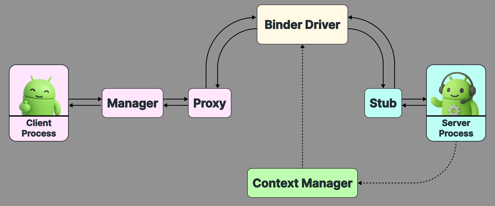

위 이미지는 `Binder` 통신 과정에서 발생하는 흐름을 시각적으로 표현한 것이다. 처음엔 생소한 용어들이 많아 복잡해 보일 수 있지만, 단계별로 개념을 알아가다 보면 자연스럽게 이해할 수 있을 것이다.

우선 클라이언트 프로세스부터 서버 프로세스까지 이어진 실선 화살표를 보면, 지금은 복잡한 용어를 모르더라도 대략적인 흐름은 짐작할 수 있을 것이다. 

하지만 서버 프로세스, `Context Manager`, `Binder Driver` 를 잇는 화살표가 점선으로 되어있는 부분에서 고개를 갸우뚱할 수 있다. 이 점선 영역이 바로 통신에 앞서 수행되어야 하는 **서비스 등록 및 준비 과정**을 나타낸다. 이 점선으로 표시된 흐름을 따라가며 준비 단계에 대해 상세히 파헤쳐보자.

## 준비 단계
#### 1. Binder Driver 실행
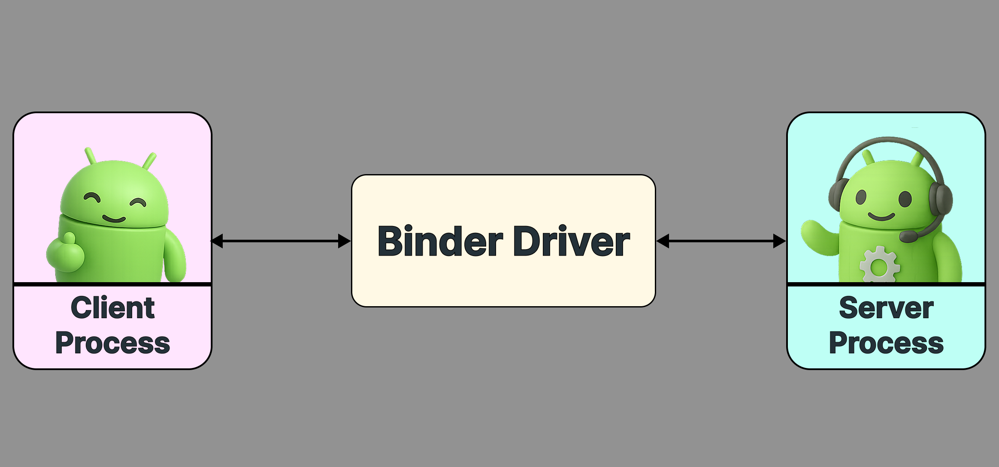

[지난 포스팅](/posts/binder-ipc/)에서 살펴본 것처럼, 안드로이드는 시스템의 기반으로 `Linux` 를 채택하고 있으며 `Linux` 는 프로세스 격리라는 특징을 갖고 있다. 따라서 하나의 프로세스는 다른 프로세스의 연산을 직접 호출할 수 없고, 이를 중개해 줄 매개체가 필요하다.

안드로이드에서는 **`Binder Driver`** 가 이 역할을 한다. `Binder Driver` 는 시스템에 등록된 모든 프로세스와 상호작용한다. 클라이언트 프로세스 요청을 서버 프로세스에 전달하고, 서버 프로세스가 보낸 결과를 다시 클라이언트 프로세스에 건네준다.

즉, `Binder Driver` 는 격리된 프로세스 사이를 이어주는 다리로, **안드로이드 시스템이 부팅될 때 가장 처음으로 실행**되는 구성 요소 중 하나다.

#### 2. Context Manager 등록
`Binder Driver` 가 생성되자마자 찾아오는 손님이 있다. 바로 **`Context Manager`** 다. 

```cpp
// servicemanager.main.cpp
int main(int argc, char** argv) {
	// . . .
	
	// Context Manager (Service Manager) 프로세스 생성
	sp<ProcessState> ps = ProcessState::initWithDriver(driver);
	
	// . . .
	
	// 해당 프로세스를 Context Manager로 지정해 달라고 Binder Driver에 요청
	ps->becomeContextManager()
}
```

`Context Manager` 는 생성과 동시에 **`Binder Driver` 에 자신을 시스템 관리자로 지정해 달라고 요청**한다.

```c
// binder.c
static int binder_ioctl_set_ctx_mgr(
	struct file *filp,  
	struct flat_binder_object *fbo
)  {  
	struct binder_proc *proc = filp->private_data;
	struct binder_context *context = proc->context;
	struct binder_node *new_node;

    new_node = binder_new_node(proc, fbo);
    
    // Context Manager로 지정
    context->binder_context_mgr_node = new_node;  
      
    return 0;  
}
```

**`Binder Driver` 는 요청을 받아 해당 프로세스를 시스템 유일 `Context Manager` 로 등록**한다. 이렇게 등록한 **`Context Manager`** 는 시스템이 종료될 때까지 **새로운 서버 프로세스들의 등록 요청을 받는다.**

등록 요청을 받으면, 해당 프로세스에 접근할 수 있는 **`handle`** 을 내부에 저장한다. 저장한 `handle` 은 클라이언트 프로세스가 연산을 요청할 때 알맞은 서버 프로세스로 연결하는 역할을 한다. 이 내용은 바로 다음 장인 [3. 서버 프로세스 등록] 에서 자세히 다룬다.

`Context Manager` 는 **`Service Manager`** 라고도 부른다. `adb shell ps` 명령어를 입력하면 아래와 같이 시스템 내에서 `Service Manager` 라는 이름으로 활성화된 것을 볼 수 있다.

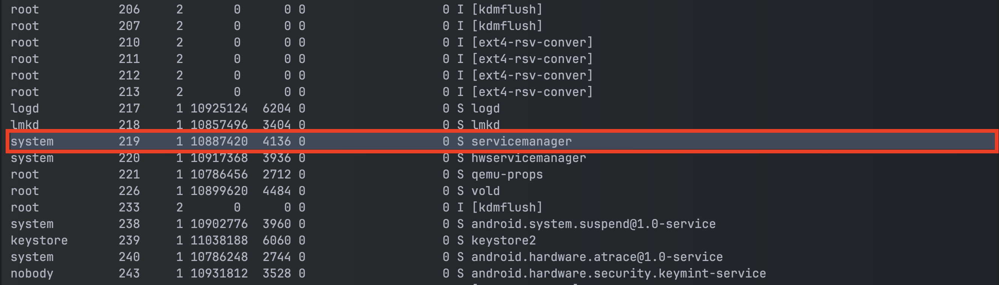

#### 3. 서버 프로세스 등록
`Context Manager` 가 등록되면, **서버 프로세스는 `Context Manager` 에 자신을 등록해 달라고 요청**한다. 등록을 마친 서버 프로세스는 언제든 `Binder` 통신에 참여할 수 있다.

등록 요청 시점은 서버 프로세스마다 다르다. `ActivityManagerService` 나 `LocationManagerService` 처럼 많이 쓰는 시스템 프로세스는 안드로이드 시스템이 켜지는 순간 `Context Manager` 에 등록을 요청한다.

서버 프로세스 등록 흐름은 다음 그림과 같다.

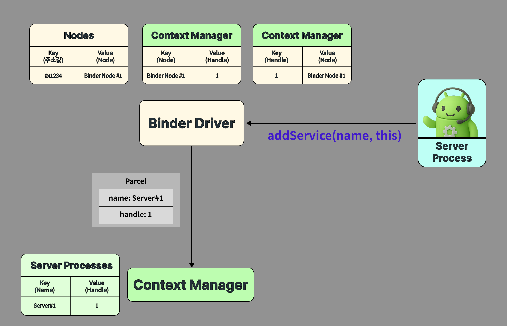

이 그림을 바탕으로 서버 프로세스 등록 흐름을 명확하게 이해해보자.

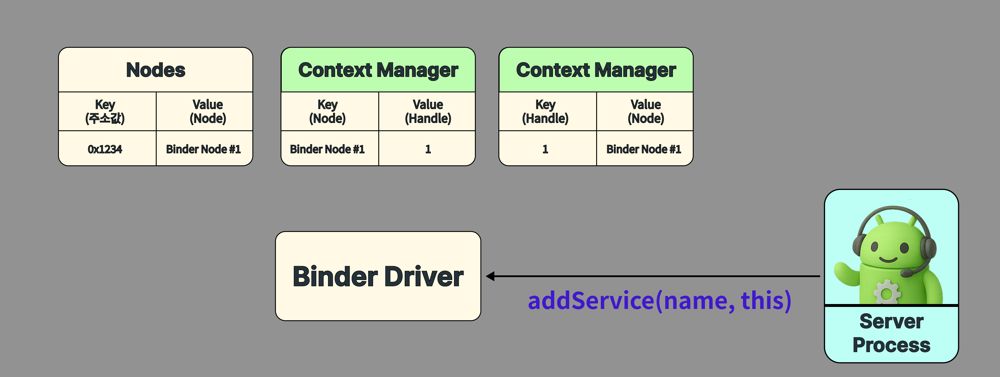

먼저 서버 프로세스가 `addService` 를 호출하여 자신을 `Context Manager` 에 등록해 달라고 요청한다. 이때 바로 `Context Manager` 로 데이터가 넘어가지 않고, `Binder Driver` 가 중간에서 여러 작업을 처리한다.

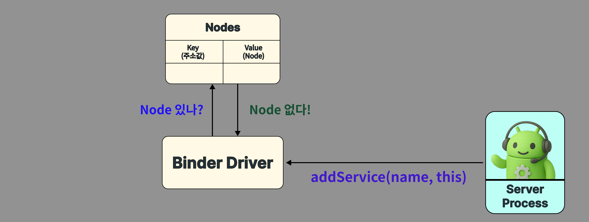

먼저, `Binder Driver` 로 서버 프로세스 이름과 참조를 넘긴다. `Binder Driver` 는 해당 서버 프로세스 **`Node`** 가 등록됐는지 먼저 확인한다. 최초로 등록하는 상황이므로 `Node` 를 새롭게 생성한다.

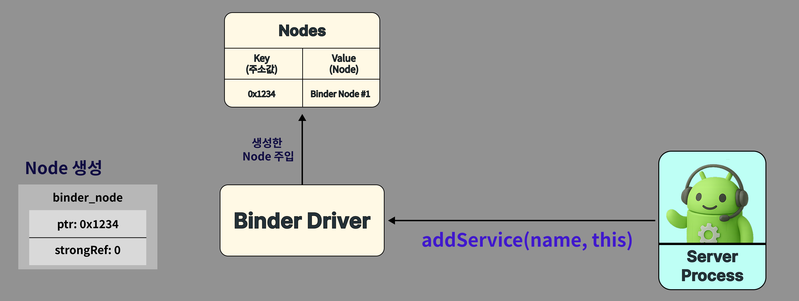

그렇다면 `Node` 는 무엇일까?

`Node` 는 `Binder Driver` 가 서버 프로세스가 무엇인지 식별하고, 관리하기 위해 생성하는 일종의 참조 모델이다. `Binder Driver` 내부에서 단일 인스턴스로 관리되고, `Node` 를 참조하는 클라이언트 프로세스가 하나라도 남아있다면 제거되지 않고 그대로 유지된다.

`Node` 내부에는 여러 데이터가 담겨있지만, 핵심 데이터는 다음 두 가지이다.

1. **서버 프로세스의 메모리 주소**

이전 포스팅에서 언급했듯 `IPC` 통신 규약에 의해 프로세스는 다른 프로세스를 직접적으로 호출할 수 없다. 따라서 `Binder Driver` 는 서버 프로세스의 메모리 주소를 `Node` 에 기록해 두었다가, 클라이언트 프로세스의 요청이 왔을 때 메모리 주소를 통해 서버 프로세스에게 요청을 전달한다.
    
2. **참조 카운트** 

현재 이 `Node`를 얼마나 많은 클라이언트 프로세스가 사용하고 있는지 나타내는 값으로, 참조 카운트가 0이 되면 `Binder Driver` 는 해당 `Node` 를 제거한다.

이 때 `Binder Driver` 는 서버 프로세스에게 자신을 참조하던 클라이언트들이 모두 사라졌음을 알리고, 서버 프로세스는 이 신호를 바탕으로 점유하던 리소스를 모두 해제한다.

결과적으로 생성된 `Node` 는 `Binder Driver` 가 관리하는 **`Node Map`** 에 저장된다.

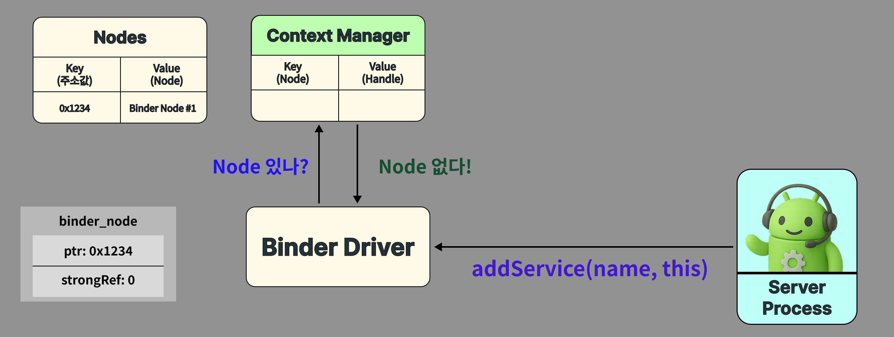

다음으로 서버 프로세스를 저장할 `Context Manager` 가 해당 `Node` 를 사용한 이력이 있는지 확인한다.

사용한 적이 있던 `Node` 라면 생성 당시 할당한 `handle` 을 그대로 사용하고, 전적이 없었다면 새로운 `handle` 을 할당한다.

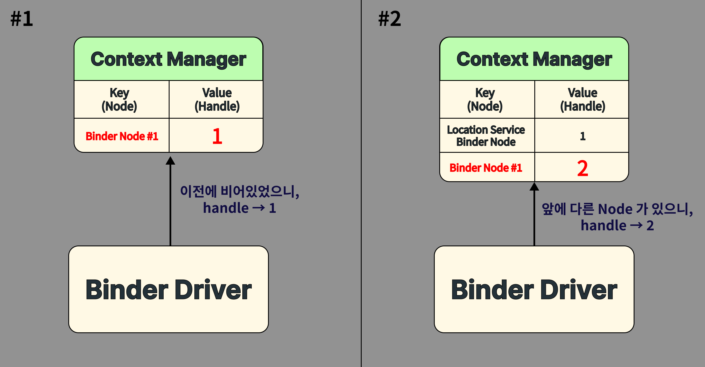

새로운 `handle` 을 할당하는 규칙은 매우 간단하다. `Node` 를 주입하는 시점에서 이미 등록된 `Node` 가 있다면, 마지막 순서로 `handle` 을 할당한다. 

그렇다면 `handle` 은 무엇일까?

`handle` 은 **클라이언트 프로세스가 서버 프로세스에 접근할 때 쓰는 `Key`** 다. 클라이언트는 이 `handle` 번호만 알면 `Binder Driver` 를 거쳐 연결된 `Node`, 즉 서버 프로세스를 호출할 수 있다.

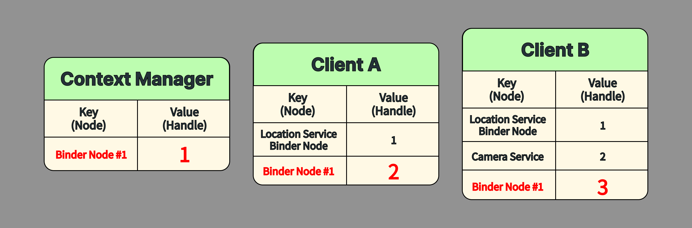

중요한 점은 **`Node` 는 `Binder Driver` 내부에 단 하나만 존재하지만, 이 `Node` 를 가리키는 `handle` 은 프로세스마다 다를 수 있다**는 점이다.

같은 `Node` 를 두고도 한 클라이언트는 `handle` 을 2번으로, 다른 클라이언트는 3번으로 설정할 수 있다.

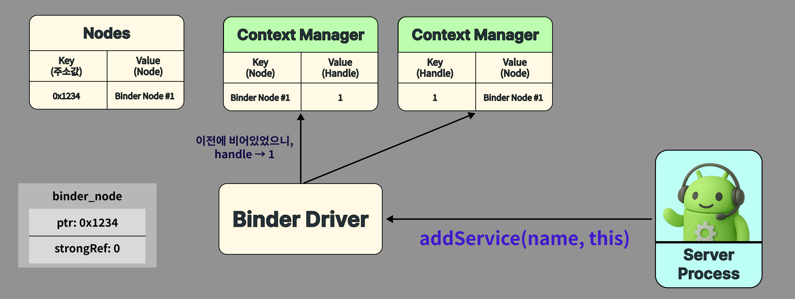

`Node` 를 생성하고 `handle` 까지 할당했다면, 이제 그 값을 두 개의 `Map` 에 저장한다. 하나는 `Node` 를 `Key` 로 하는 `Map` 이고, 또 하나는 `handle` 을 `Key` 로 하는 `Map` 이다.

두 `Map`은 각각 다음 상황에서 활용된다.

*   **`Node` 를 `Key` 로 하는 `Map`**
	* 현 상황과 같이 서버 프로세스가 `addService` 를 호출하는 경우
*   **`handle` 을 `Key` 로 하는 `Map`** 
	* 추후 클라이언트 프로세스가 `getService` 를 호출하는 경우
	* 이 케이스는 다음 포스팅에서 상세히 다룬다.

`Map` 에 저장하는 과정까지 마쳤다면 `Binder Driver` 에서의 과정은 끝이다. 이제 `handle` 을 목표 지점인 **`Context Manager`** 로 전달할 차례다.

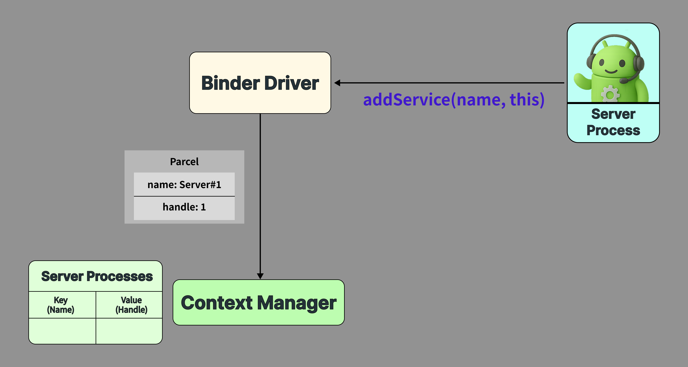

등록할 서버 프로세스 이름과 `handle` 을 **`Parcel`** 이라는 데이터 컨테이너에 담아 `Context Manager` 로 전송한다.

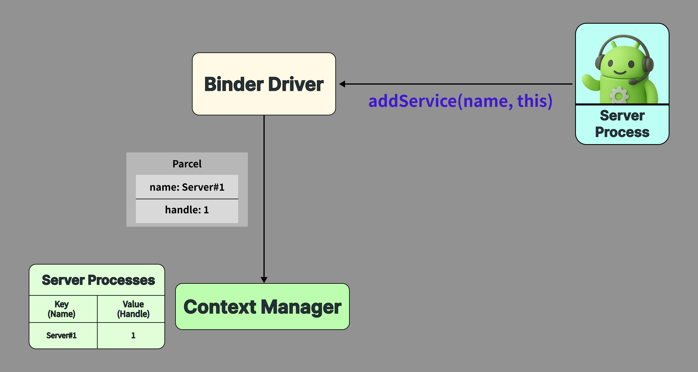

`Context Manager` 는 `Parcel` 을 분해하여 서비스 이름을 `Key` 로, `handle`을 `Value` 로 매핑하여 내부 `Map` 에 저장한다.


해당 과정까지 마치면, 결과적으로 가장 처음에 보았던 이미지와 같이 `Context Manager` 내부에 서버 프로세스가 저장된 것을 볼 수 있다. 이렇게 저장한 `Node`, `handle` 등의 데이터는 추후 클라이언트 프로세스가 서버 프로세스의 연산을 요청할 때 사용된다.

---

## 마치며

이번 포스팅에서는 `Binder` 통신이 본격적으로 시작되기 전, **준비 과정**을 살펴봤다.

다음 포스팅에서는 **클라이언트 프로세스가  `getService` 로 서버 프로세스를 찾고, 실제 데이터를 주고받는 과정**을 다이어그램과 함께 자세히 살펴본다.

---

### References
- Android Code Search
	- [framework/native/cmds/servicemanager/main.cpp](https://cs.android.com/android/platform/superproject/main/+/main:frameworks/native/cmds/servicemanager/main.cpp)
	- [common/drivers/android/binder.c](https://cs.android.com/android/kernel/superproject/+/common-android-mainline:common/drivers/android/binder.c)
	- [frameworks/native/libs/binder/BpBinder.cpp](https://cs.android.com/android/platform/superproject/main/+/main:frameworks/native/libs/binder/BpBinder.cpp?hl=ko)
