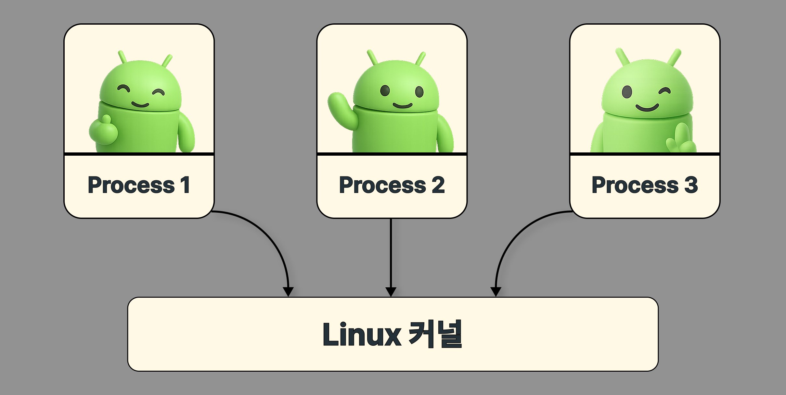
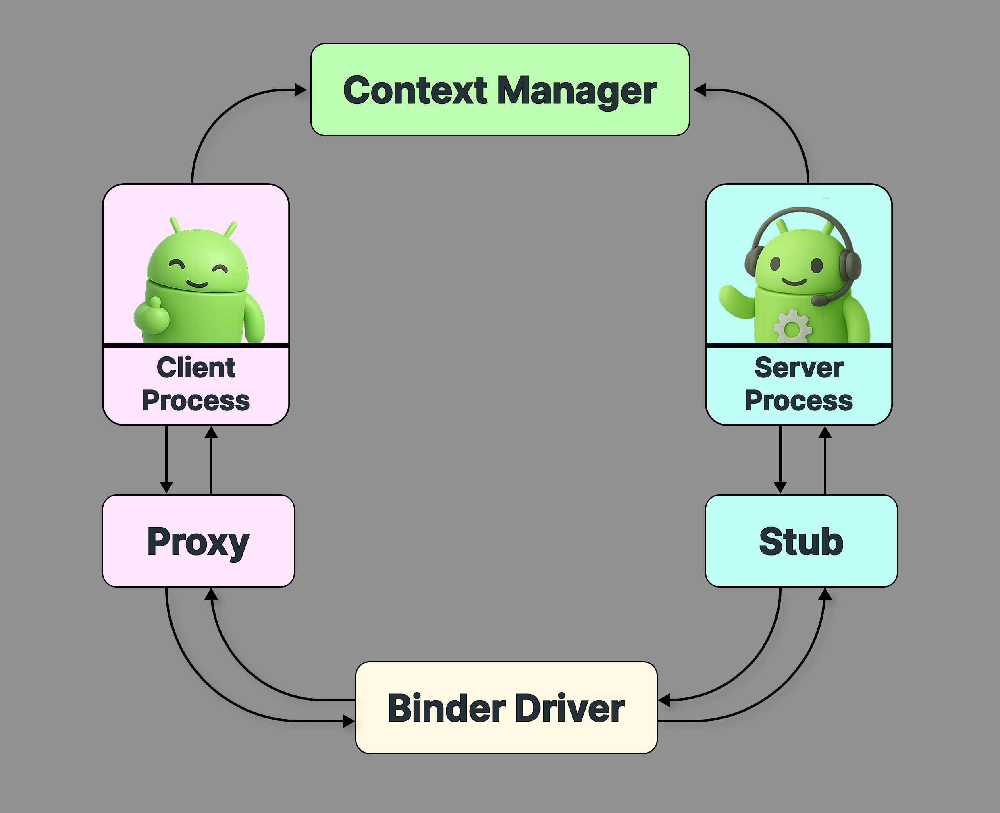
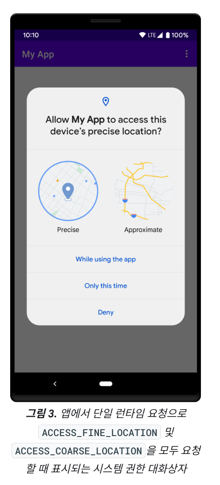

+++
title = "Binder 란?"
date = 2025-09-05T00:00:00+09:00
draft = false
tags = ["Android", "IPC", "Binder"]
series = ["Android Binder"]
+++

## 개요

앱을 사용하다 보면, 갤러리에서 프로필 사진을 고르거나 카메라로 사진을 찍는 경우가 있다. 사용자 입장에서는 마치 하나의 앱에서 모든 일이 자연스럽게 처리되는 것처럼 보인다. 하지만 실제로는 ‘갤러리’를 담당하는 앱과 ‘카메라’를 담당하는 앱이 **서로 다른 프로세스에서 독립적으로 실행되고 있다**.

그렇다면 안드로이드는 어떻게 독립된 앱들을 하나로 이어주는걸까? 이것을 가능하게 해주는 것이 바로 안드로이드의 핵심 `IPC` 메커니즘인 **`Binder`** 이다. 이번 포스팅에서는 `Binder IPC` 가 어떤 역할을 하고, 왜 필요한지 그 개념을 차근차근 살펴본다.

---

## 안드로이드와 Linux

`Binder`를 이해하려면, 먼저 안드로이드가 어떤 기반 위에서 동작하는지 알아야 한다. 


<div style="text-align: center;"> [안드로이드 공식 문서](https://developer.android.com/guide/platform?hl=ko)</div>

안드로이드는 시스템의 기반으로 `Linux` 커널을 채택했다. 이는 `Linux` 가 하드웨어 이식이 용이하며, 메모리 관리나 보안 같은 핵심 시스템 서비스가 이미 잘 갖추어져 있기 때문이다.

`Linux` 에서 특히 주목해야 할 특징은 **프로세스 격리(Process isolation)** 다. 각 프로세스는 독립된 메모리 공간에서 실행되어 다른 프로세스의 영향을 전혀 받지 않는다. 덕분에 하나의 앱에 문제가 발생해도 시스템 전체의 안정성을 유지할 수 있다. 

하지만 언제나 트레이드오프는 있는 법이다. 안정성과 보안을 확보한 대신, 프로세스들이 서로 완전히 분리되어 있어 협력이 필요한 경우 별도의 통신 메커니즘이 필요했다.

### IPC 통신



그래서 `Linux` 는 프로세스간 통신을 위해 특별한 통신 메커니즘을 지원하는데, 이것이 바로 `IPC` 이다.

`IPC` 는 위 이미지와 같이 커널을 중간 매개체로 삼아 프로세스끼리 통신하는 방식으로, 전통적 `IPC` 기법에는 공유 메모리, 파이프, 메시지 큐 등이 있다. 해당 기법들은 실제로 데이터베이스 시스템이나 웹 서버, 게임 등에서 널리 활용되고 있다.

하지만 안드로이드는 전통적인 IPC를 사용하지 않음을 다음과 같이 명시하였다.

["Android does not support System V IPCs, i.e. the facilities provided by the following standard Posix headers: `<sys/sem.h>`, `<sys/shm.h>`, `<sys/msg.h>`, `<sys/ipc.h>`"](https://android.googlesource.com/platform/ndk/+/4e159d95ebf23b5f72bb707b0cb1518ef96b3d03/docs/system/libc/SYSV-IPC.TXT)

안드로이드는 왜 전통적 `IPC` 의 사용을 거부했을까?

안드로이드 환경에서는 앱이 예기치 않게 종료되거나, 시스템에 의해 강제 종료되는 경우가 빈번하다. 하지만 전통 `IPC` 방식을 사용할 경우 프로세스가 살아있는지 실시간으로 추적할 수 없고, 이로 인해 메모리 누수가 발생할 수 있다.

또한 안드로이드는 앱마다 필요한 권한이 모두 다른데, 전통 `IPC` 방식을 사용한다면 통신을 할 때마다 대상 프로세스가 필요한 권한을 가지고 있는지 개발자가 모두 일일이 검증해야만 한다.

이러한 문제들로 인해 안드로이드는 새로운 `IPC` 메커니즘을 개발하기 시작했다.

## Binder

그리고 개발의 결과물이 바로 `Binder` 이다.



`Binder` 는 커널 내부의 `Binder Driver` 를 매개체로 하여 프로세스 간 통신을 지원하는 메커니즘으로, 안드로이드에서 발생하는 거의 모든 `IPC` 통신은 `Binder` 를 통해 이루어진다.

동작 방식은 간단하다. 서비스를 제공할 서버 프로세스가 `Binder Driver` 에 자신을 등록하면, 서비스가 필요한 클라이언트 프로세스가 `Binder Driver` 를 통해 해당 서비스를 요청하는 구조다. 모든 프로세스는 필요에 따라 서버나 클라이언트 역할을 할 수 있다.

`Binder` 의 가장 큰 특징은 **클라이언트 프로세스의 생명 주기를 실시간으로 추적**하고, 동시에 **요청을 보낸 클라이언트 프로세스가 적절한 권한을 가지고 있는지 확인**할 수 있다는 점이다. 덕분에 불필요한 메모리 점유를 빠르게 해제할 수 있고, 권한이 없는 접근을 차단하여 보안을 강화할 수 있다.

또한 `Binder` 는 `IPC` 과정에서 발생할 수 있는 복잡한 스레드 전환이나 동기화 문제를 내부적으로 모두 처리한다. 개발자는 서비스가 필요한 경우 복잡하게 생각할 것없이 그저 서비스를 호출하기만 하면 된다. 즉, `Binder` 는 개발 편의성까지 향상시킨다.

그렇다면 `Binder` 는 이러한 특징들을 어떤 방식으로 구현하고 있는걸까? **지도 앱을 만든다고 가정**하고, 구현 방식에 대해 쉽게 이해해보자.

### Death Notification
앞서 언급했듯 `Binder` 를 사용하면 메모리 부족, 크래시, 강제 종료 등으로 앱이 갑자기 종료된 경우 이를 즉각적으로 감지하여 효율적으로 메모리를 관리할 수 있다.

지도 앱 내에서 현재 사용자의 위치를 지속적으로 출력해야 한다고 가정해보자. 구현을 위해 다음과 같이 `LocationManager` 에게 주기적으로 현재 위치를 반환할 것을 요청한다.

```kotlin
val locationManager = getSystemService(LOCATION_SERVICE) as LocationManager  
locationManager.requestLocationUpdates(  
    LocationManager.GPS_PROVIDER,  
    1000L,  
    1f  
) { location ->  
    val (latitude, longitude) = location.latitude to location.longitude  
}
```

그런데, 갑자기 앱에서 어떠한 이유로 인해 크래쉬가 발생했다. 이 상황에서 `LocationManager` 가 죽은 앱에게 위치를 지속적으로 전송하면, 메모리 누수가 발생할 것이다.

이를 방지하기 위해 안드로이드는 `Death Recipient` 를 사용한다. 직역하자면 '죽음 수신자' 라는 뜻으로, `LocationManager` 의 `requestLocationUpdates` 를 호출하는 순간부터 동작한다. 실제 `LocationManagerService` 의 [구현 코드](https://android.googlesource.com/platform/frameworks/base/+/7e361d2/services/java/com/android/server/LocationManagerService.java)는 다음과 같다.

```java
private Receiver getReceiverLocked(  
    ILocationListener listener,  
    // . . .  
) {  
    IBinder binder = listener.asBinder();  
    Receiver receiver = mReceivers.get(binder);  
  
    // . . .  
  
    receiver = new Receiver(listener);
    
    // Death Recipient 등록  
    receiver.getListener().asBinder().linkToDeath(receiver, 0);  
  
    // . . .  
    
    return receiver;  
}

// 앱 종료 감지 시 호출
@Override  
public void binderDied() {  
    removeUpdatesLocked(this);  
}

// 클라이언트 프로세스와의 링크 제거 및 Death Recipient 해제
private void removeUpdatesLocked(Receiver recevier) {
	if (mReceivers.remove(receiver.mKey) != null && receiver.isListener()) {
		receiver.getListener().asBinder().unlinkToDeath(receiver, 0);			
	}
}
```

코드를 보면 알 수 있듯이 동작 방식은 의외로 매우 간단하다. 

1. `requestLocationUpdates` 호출 시 위치 탐지 시 데이터를 전송할 `Recevier` 를 등록하고, `linkToDeath` 를 통해 앱 종료 관찰을 시작한다.
2. 앱 종료 시 `binderDied` 메소드가 호출되고, 내부에서 `removeUpdateLocked` 를 호출한다.
3. `Recevier` 를 제거하고, `unlinkDeath` 를 호출하여 관찰을 종료한다.

이 과정을 통해 안드로이드는 메모리 누수를 방지한다. 물론, 개발자는 이 과정에 전혀 관여하지 않는다. 그저 시스템 서비스에게 요청을 보낼 뿐이다.

### 권한 검사
`Binder` 는 통신이 발생할 때마다 **클라이언트의 `PID`, `UID` 정보를 서버 프로세스에게 전달**한다. 해당 정보를 활용하여 서버 프로세스는 클라이언트 프로세스가 필요한 권한을 가지고 있는지 검사한다.

여기서 한 가지 의문인 점은, `Binder` 가 클라이언트의 정보를 서버에 전달한다는 것이다. 클라이언트가 직접 서버에 전달하는 것이 더 간단해보이는데, 왜 굳이 `Binder` 가 대신 전달하는 것일까?

이는 **보안**과 관련되어 있다. 만약 클라이언트가 자신의 정보를 직접 전달한다면, 이를 조작하여 서버 프로세스를 속일 수 있다. 권한을 예로 들면 실제로는 위치 권한을 가지고 있지 않더라도 권한이 있다고 조작을 할 수 있는 것이다.

`Binder` 는 이러한 보안 위협을 원천 봉쇄한다. 프로세스 간 통신이 발생하는 순간, **커널에서 직접 `PID`, `UID` 를 조회**하여 서버에 전달한다. 이때는 클라이언트가 개입할 수 있는 방법이 없으므로, 정보를 조작하는 것이 불가능하다.

이후 서비스는 신뢰할 수 있는 `PID`, `UID` 를 활용하여 클라이언트가 누구인지 파악한 후 해당 클라이언트가 작업을 호출할 권한이 있는지 판단한다. 

실제 구현 흐름은 다음과 같다.

```java
@Override
public void requestLocationUpdates(LocationRequest request, ILocationListener listener,
        PendingIntent intent, String packageName) {
    int allowedResolutionLevel = getCallerAllowedResolutionLevel();
    checkResolutionLevelIsSufficientForProviderUse(allowResolutionLevel);
    
    // ~ 위치 요청 
}
```

`requestLocationUpdates` 호출 시, 자체적으로 `getCallerAllowedResolutionLevel` 메소드를 호출한다. 함수명을 직역하면 '호출자의 허용된 해상도 레벨 획득' 이라는 뜻인데, 이는 안드로이드 위치 권한과 관련이 있다.



안드로이드의 위치 권한은 세 단계로 나눠진다.

1. 위치 요청 권한이 완전히 없는 경우 (`NONE`)
2. 네트워크 기반으로 대략적으로 위치를 요청할 수 있는 경우 (`COARSE`)
3. 네트워크, GPS를 기반으로 정밀하게 위치 정보를 요청할 수 있는 경우 (`FINE`)

즉, `getCallerAllowedResolutionLevel` 는 클라이언트 프로세스가 어떤 권한까지 허용했느냐에 따라 0~2 중 하나의 숫자를 반환한다.

```java
private int getCallerAllowedResolutionLevel() {
    return getAllowedResolutionLevel(Binder.getCallingPid(), Binder.getCallingUid());
}
```

실제 구현은 위와 같이 구성되어 있다. **여기서 중요한 것은, 앞서 언급했듯 `Binder` 를 통해 조작이 불가능한 `PID`, `UID` 를 받아온다는 점**이다. 

```java
private int getAllowedResolutionLevel(int pid, int uid) {
    // ACCESS_FINE_LOCATION 권한 확인
    if (mContext.checkPermission(android.Manifest.permission.ACCESS_FINE_LOCATION,
            pid, uid) == PackageManager.PERMISSION_GRANTED) {
        return RESOLUTION_LEVEL_FINE;    // 정밀한 위치 (네트워크 + GPS)
    } 
    // ACCESS_COARSE_LOCATION 권한 확인
    else if (mContext.checkPermission(android.Manifest.permission.ACCESS_COARSE_LOCATION,
            pid, uid) == PackageManager.PERMISSION_GRANTED) {
        return RESOLUTION_LEVEL_COARSE;  // 대략적 위치 (네트워크)
    } 
    // 권한 없음
    else {
        return RESOLUTION_LEVEL_NONE;    
    }
}
```

`getCallerAllowedResolutionLevel` 가 호출하는 `getAllowedResolutionLevel` 에서 실제로 `PackageManager` 를 통해 **클라이언트 프로세스가 어떤 위치 권한을 가지고 있는지 확인하고 권한 레벨을 리턴**한다.

이후 `checkResolutionLevelIsSufficientForProviderUse` 메소드를 통해 클라이언트 프로세스의 권한 레벨이 실제 위치 요청에 필요한 권한 레벨에 도달했는지 검사한다. 예를 들어 클라이언트 프로세스가 정밀한 위치의 추적을 요구하였으나 실제 가지고 있는 권한은 `COARSE` 레벨이라면, 즉시 `SecurityException` 을 `throw` 하는 방식이다.

이러한 방식으로 모든 시스템 서비스들은 `Binder` 가 제공하는 신뢰성 있는 정보를 활용하여 **클라이언트 프로세스가 필요한 권한을 가지고 있는지 모두 검사**한다. 권한이 없다면 즉시 `SecurityException` 을 발생시켜 시스템 보안을 보장한다.

### Thread migration model
다시 돌아가, 실시간으로 위치 정보를 사용하기 위해 구현했던 로직을 살펴보자.

```kotlin
val locationManager = getSystemService(LOCATION_SERVICE) as LocationManager  
locationManager.requestLocationUpdates(  
    LocationManager.GPS_PROVIDER,  
    1000L,  
    1f  
) { location ->  
    val (latitude, longitude) = location.latitude to location.longitude  
}
```

코드를 처음 봤을 땐 다른 코드와 동일하게 현재 스레드, 즉 UI 스레드에서 작업이 실행될 것으로 보인다. **하지만 UI 스레드에서 그대로 시스템 서비스를 호출하던 중 UI 스레드에 문제가 발생하면 어떻게 될까?** 시스템 기능을 실행하던 스레드 자체가 사라졌으니, 이를 관리하는 안드로이드 시스템 자체에 문제가 발생할 수 있다.

이런 문제를 방지하기 위해, **`Binder` 는 서비스 호출 시 자동으로 스레드를 전환**한다. 위 예제에서`getSystemService`, `requestLocationUpdates` 를 호출하면, 실제 작업은 다른 스레드에서 수행되는 것이다.

실제 동작은 다음과 같은 흐름으로 진행된다.

1. 함수 호출 시 UI 스레드는 즉시 블락된다. 
2. 호출한 함수는 `Binder` 에서 관리하는 스레드에서 계속 실행된다.
3. 실행이 완료되면 결과를 현재 UI 스레드로 반환한다. 
4. UI 스레드의 블락 상태 역시 해제된다.

**`Binder` 는 스레드 전환뿐 아니라 데이터 직렬화, 권한 검증 등 복잡한 IPC 과정을 모두 자동으로 처리**한다. 만약 개발자가 이 모든 과정을 직접 구현해야 했다면 엄청난 양의 코드와 복잡한 오류 처리가 필요했을 것이다. 

`Binder` 는 이러한 복잡성을 완전히 숨겨 **개발자가 로컬 함수를 호출하는 것처럼 간단하게 시스템 서비스를 사용**할 수 있도록 돕는다.

## 제한사항
하지만 `Binder` 에도 제한사항은 존재한다.

가장 큰 제한사항은 통신 대상 데이터의 사이즈를 **1MB로 제한하는 것**이다. 만약 데이터 사이즈가 1MB를 넘어갈 경우, `Intent` 와 `Bundle` 을 다루며 많이 목격했을 **`TransactionTooLargeException`** 이 발생한다. 

왜 1MB까지만 지원하는지에 대해서는 여러 문서를 찾아보았는데, 일단 안드로이드 측에서 공식적으로 내놓은 입장은 없는 것으로 보인다. [2014년 구글 이슈 트래커](https://issuetracker.google.com/issues/36999615) 에서도 이미 최대 사이즈의 증가를 요청했으나 공식적인 답변은 등록되지 않았다.

개인적으로 추측해보면 시스템 안정성과 보안이 주된 이유로 보인다. 한 클라이언트 프로세스에서 의도적으로 큰 데이터를 보낼 경우 안드로이드 자체에 큰 부하가 걸려 시스템이 마비될 것으로 보이는데, 아마도 이를 방지하기 위한 것으로 생각된다.

크기 제한 외에도 **타입 제한**이 존재한다. `Binder` 를 활용하여 통신하는 경우 아래에 있는 타입들만을 활용해야 한다.

- `null`
- 자바 기본 타입 (`int`, `long`, `char`, `boolean` 등)
- 배열
- `String`
- `CharSequence`
- `List`, `Map`
- `java.io.Serializable`
- `java.io.FileDescriptor`
- `Bundle`

이는 `Binder` 통신을 위해 특수하게 제작된 **`Parcel`** 이 지원하는 타입과 동일하다. `Parcel` 을 활용하여 `Binder` 통신을 진행할 경우, 메모리 효율성과 통신 속도의 향상을 기대할 수 있다.

## 마치며
지금까지 `Binder` 가 탄생한 이유와 핵심 특징들을 살펴보았다. 공부를 하면서 느낀건 `Binder` 가 여태까지 당연하게 사용했던 모든 기능에 관여하고 있었다는 점이었다. 

사용자로서는 카메라에 접근하여 사진을 찍었던 것, 개발자로서는 `Intent` 를 통해 데이터를 전달했던 것, 모두 `Binder` 가 있었기에 가능한 동작들이었다. 어떤 문서에서는 **"`Binder` 가 곧 안드로이드다."** 라는 표현을 썼었는데, 공부를 해보니 이 표현에 십분 공감하게 됐다.

다음 포스팅에서는 실제 통신 발생 시에 `Binder` 가 어떻게 동작하는지 깊이 있게 탐구해보도록 한다.

---

### References

- [Deep Dive into Android IPC/Binder Framework](https://www.youtube.com/watch?v=Jgampt1DOak&t=98s)
- [Operation Binder: Secrets of Inter-Process Communication](https://www.youtube.com/watch?v=Fb4UoqXPEtI&t=587s)
- [Android 프로세스의 통신 메커니즘: 바인더](https://d2.naver.com/helloworld/47656?source=post_page-----756d4fa2731a---------------------------------------)
- [안드로이드, 어디까지 아세요 [2.2] — Bound Service, IPC](https://medium.com/mj-studio/%EC%95%88%EB%93%9C%EB%A1%9C%EC%9D%B4%EB%93%9C-%EC%96%B4%EB%94%94%EA%B9%8C%EC%A7%80-%EC%95%84%EC%84%B8%EC%9A%94-2-2-bound-service-ipc-87237c4a38ca)
- [Parcel](https://developer.android.com/reference/android/os/Parcel)
- [Bound Services Overview](https://developer.android.com/develop/background-work/services/bound-services)
