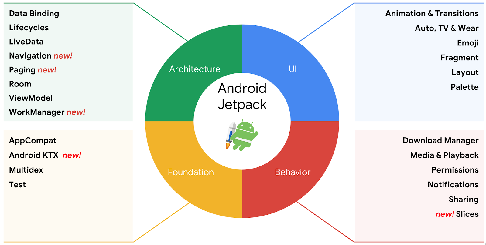
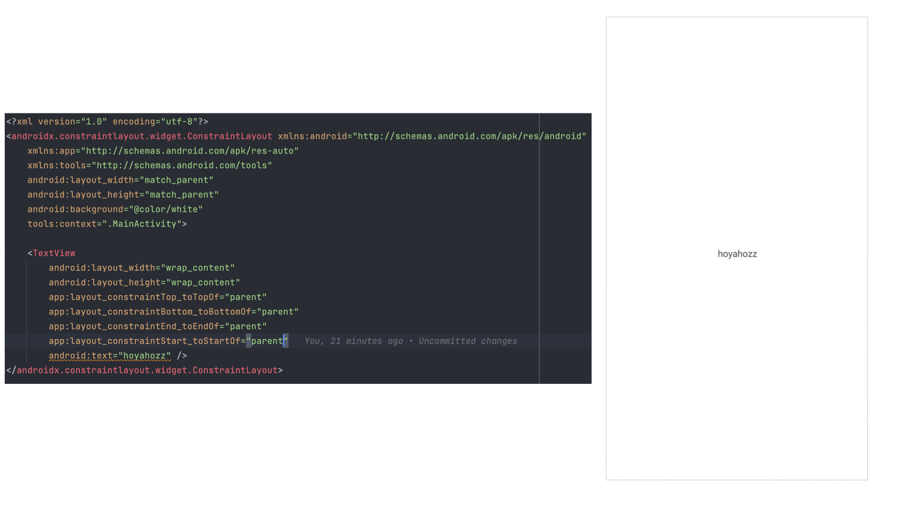
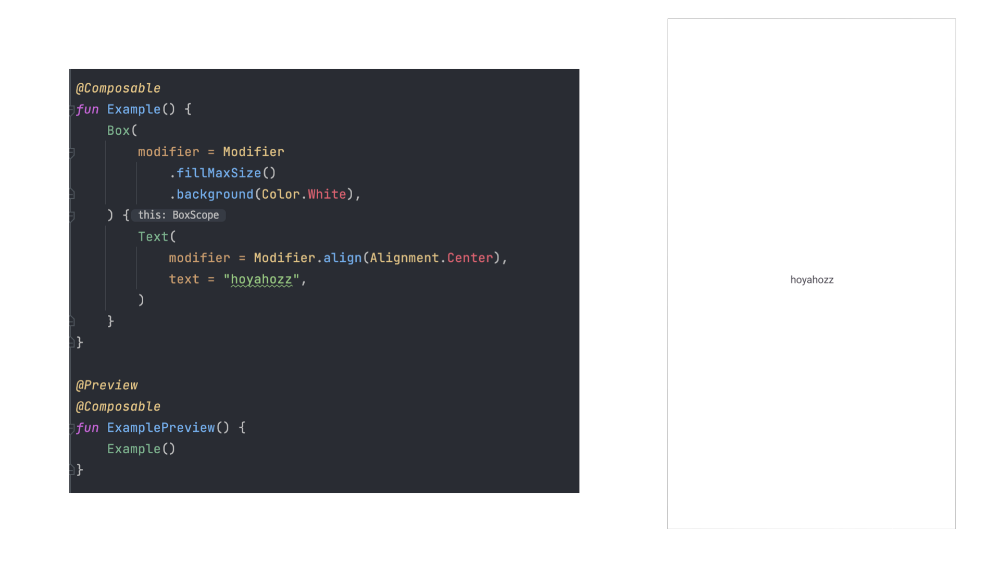
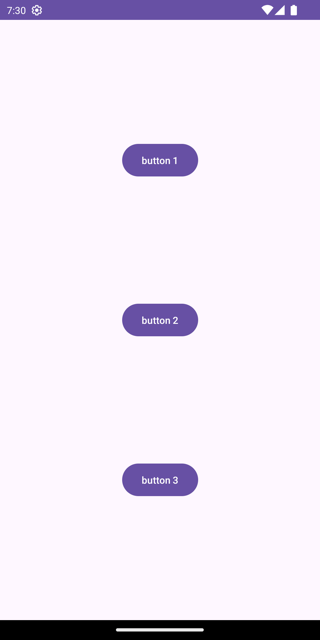
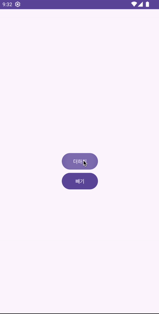
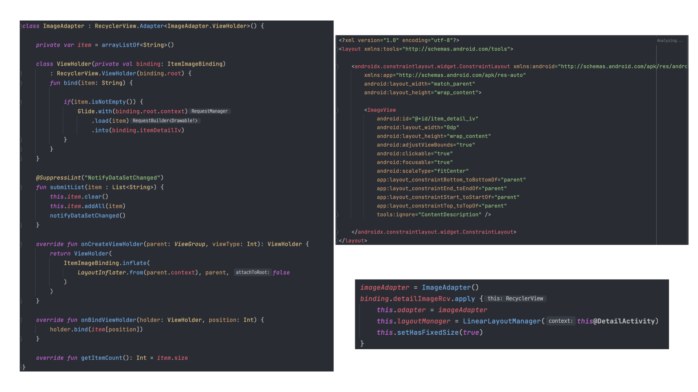
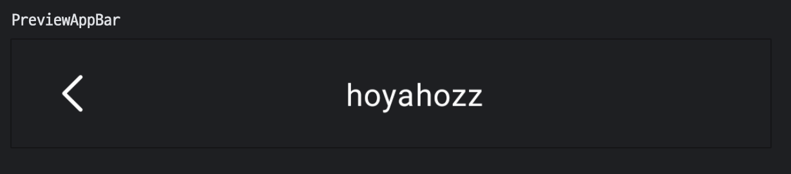
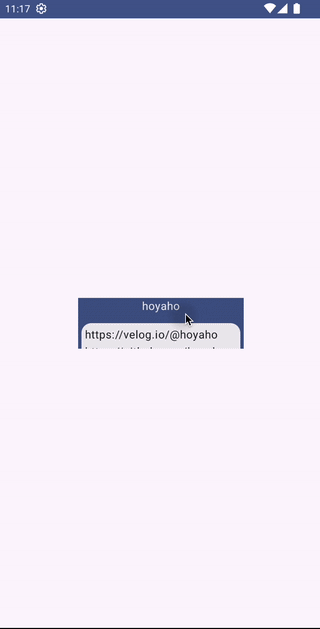
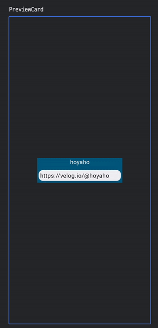

+++
title = "예제로 살펴보는 Jetpack Compose 의 장점"
date = 2024-02-18
draft = false
description = "실제 프로젝트 경험을 바탕으로 Jetpack Compose 도입 시 얻는 장점을 예제로 살펴봅니다."
tags = ["Android", "Compose"]
+++

벌써 `Jetpack Compose` 가 스테이징으로 출시된지 2년이 훌쩍 넘어가고 있는 시점입니다. 그 사이 `Jetpack Compose` 는 불안정했던 초기 버전을 지나 구글의 적극적인 지원으로 안드로이드 생태계에 빠르게 자리를 잡았는데요, 현재는 많은 프로젝트에서 안드로이드 UI 툴킷으로 `Jetpack Compose` 를 적극적으로 채택하고 있는 추세입니다.

이러한 흐름에 맞게 이제는 `Jetpack Compose` 를 프로젝트에 도입해볼까 하는 안드로이드 개발자분들이 많으실 것 같아요. 이 고민에 작은 도움이 되고자 이번 포스팅에서는 **안드로이드 주니어 개발자인 제가 2개의 사이드 프로젝트와 1개의 사내 프로젝트를 개발하고 출시하며 느꼈던 `Jetpack Compose` 의 장점**에 대해 간략하게 이야기 해보려고 해요!

---

## 🤔 Jetpack Compose?

장단점을 설명하기 앞서 `Jetpack Compose` 가 어떤 기술인지 간략하게 알아볼까요?



우선 **`Jetpack` 은 안드로이드 개발자들이 손쉽고 빠르게 안드로이드를 개발할 수 있도록 지원하는 도구 모음집**을 의미합니다. 즉, **`Compose` 는 `Jetpack` 이라는 공구함 내에 있는 하나의 도구**라고 말할 수 있는 것이지요.

그렇다면 `Compose` 는 무엇일까요? `Compose` 를 이해하기 위해 우선 기존의 안드로이드 UI 개발 방식부터 천천히 알아가보도록 합시다.



원래 안드로이드는 위 이미지와 같이 아주 오랜 기간동안 `XML` 을 이용해 UI를 구성했었습니다. 나쁜 방식은 아니었지만, `XML` 과 코틀린(자바) 코드 사이를 오가며 개발을 하는 것이 여간 번거로운게 아니었어요. 



하지만 **`Compose` 에서는 이렇게 코틀린 코드만을 이용해 UI를 구성**할 수 있습니다! 해당 코드가 어떤 식으로 렌더링되는지도 `Preview` 를 통해 바로 볼 수 있으니, 파일 사이를 왔다갔다 하며 개발을 할 필요가 없어진 것이지요.

순수 코틀린 코드로 UI를 작성할 수 있다는 것 외에 또 다른 큰 차이가 있는데요. 바로 **명령형 UI 가 아닌 선언형 UI 패러다임을 채택**했다는 점입니다. 명령형 UI, 선언형 UI의 차이점은 무엇일까요?

```kotlin
fun observeCount() {
	viewModel.count.observe(this) { count ->
    	with(binding.countView) {
        	text = count
        	setTextColor(red)
            background = blue
        }
    }
}
```

우리가 그동안 흔히 봐왔던 코드 전개입니다. 상태의 변경이 일어날 때 뷰의 색깔을 **'직접'** 지정해주고, 뷰의 배경을 **'직접'** 지정해주고 있습니다. 이처럼, **명령형 UI는 우리가 '이렇게 변해라!'라고 명령을 내려주는 방식**이라고 볼 수 있습니다.

```kotlin
@Composable
fun CountView(text: String) {
	Text(
    	modifier = Modifier.background(blue)                
    	text = text,
      	color = Red
    )
}
```

명령형 UI 코드와는 달리, 선언형 UI 코드에서는 개발자가 직접 명령하지 않고, 상태만 내려주고 있습니다. 상태를 내려주면 알아서 자기 자신을 그리고 배치합니다. **우리는 그저 '우리는 이런 UI를 원한다'고 '선언'만 하면 되는 셈**이지요. 

**선언형 UI 패러다임으로의 전환은 안드로이드 뷰 코드의 직관성, 가독성 향상에 큰 기여**를 했는데요. 이에 관한 부분은 아래 장점 부분에서 자세히 살펴보도록 하겠습니다.

이제 `Compose` 가 어떤 기술인지 조금은 감이 오셨나요? 이제 **제가 개발을 하며 직접 느꼈던 `Compose` 의 장점**에 대해 이야기해보도록 하겠습니다.

---

## 💪 `Compose` 의 장점

### 📌 간결하고 깔끔한 코드

**`Compose` 를 사용하면, 기존 안드로이드 뷰 시스템에 비해 훨씬 더 간결하고 깔끔한 코드를 작성**할 수 있습니다.



비교를 위해 위 이미지의 뷰를 안드로이드 뷰 시스템, `Compose` 순으로 구현해보겠습니다.

```xml
<?xml version="1.0" encoding="utf-8"?>
<androidx.constraintlayout.widget.ConstraintLayout xmlns:android="http://schemas.android.com/apk/res/android"
    xmlns:app="http://schemas.android.com/apk/res-auto"
    xmlns:tools="http://schemas.android.com/tools"
    android:layout_width="match_parent"
    android:layout_height="match_parent"
    tools:context=".MainActivity">

    <Button
        android:id="@+id/button1"
        android:layout_width="wrap_content"
        android:layout_height="wrap_content"
        android:text="Button 1"
        app:layout_constraintBottom_toTopOf="@id/button2"
        app:layout_constraintEnd_toEndOf="parent"
        app:layout_constraintStart_toStartOf="parent"
        app:layout_constraintTop_toTopOf="parent" />

    <Button
        android:id="@+id/button2"
        android:layout_width="wrap_content"
        android:layout_height="wrap_content"
        android:text="Button 2"
        app:layout_constraintBottom_toTopOf="@id/button3"
        app:layout_constraintEnd_toEndOf="@id/button1"
        app:layout_constraintStart_toStartOf="@id/button1"
        app:layout_constraintTop_toBottomOf="@id/button1" />

    <Button
        android:id="@+id/button3"
        android:layout_width="wrap_content"
        android:layout_height="wrap_content"
        android:text="Button 3"
        app:layout_constraintBottom_toBottomOf="parent"
        app:layout_constraintEnd_toEndOf="@id/button1"
        app:layout_constraintStart_toStartOf="@id/button1"
        app:layout_constraintTop_toBottomOf="@id/button2" />
</androidx.constraintlayout.widget.ConstraintLayout>
```

```kotlin
class MainActivity : AppCompatActivity() {
    private lateinit var binding: ActivityMainBinding

    override fun onCreate(savedInstanceState: Bundle?) {
        super.onCreate(savedInstanceState)
        binding = ActivityMainBinding.inflate(layoutInflater)
        setContentView(binding.root)

        initEvent()
    }

    private fun initEvent() {
        with(binding) {
            button1.setOnClickListener {
                anything()
            }

            button2.setOnClickListener {
                anything()
            }

            button3.setOnClickListener {
                anything()
            }
        }
    }

    private fun anything() { /* . . . */ }
}
```

기존의 안드로이드 뷰 시스템으로 구현된 코드입니다. **`XML` 과 코틀린 코드 사이를 오가며 로직을 작성하고 있는 모습**을 확인할 수 있습니다. 

```kotlin
class ComposeActivity : ComponentActivity() {
    override fun onCreate(savedInstanceState: Bundle?) {
        super.onCreate(savedInstanceState)
        setContent {
            CompareAndroidViewSystemTheme {
                ThreeVerticalButton()
            }
        }
    }
}

@Composable
fun ThreeVerticalButton() {
    Column(
        modifier = Modifier
            .fillMaxSize()
            .background(MaterialTheme.colorScheme.background),
        verticalArrangement = Arrangement.SpaceEvenly,
        horizontalAlignment = Alignment.CenterHorizontally
    ) {
        Button(
            onClick = { anything() }
        ) {
            Text(text = "Button 1")
        }
        Button(
            onClick = { anything() }
        ) {
            Text(text = "Button 2")
        }
        Button(
            onClick = { anything() }
        ) {
            Text(text = "Button 3")
        }
    }
}

private fun anything() { /* . . . */ }

@Preview
@Composable
fun PreviewThreeVerticalButton() {
    CompareAndroidViewSystemTheme {
        ThreeVerticalButton()
    }
}
```

`Compose` 로 구현된 코드입니다. `ThreeVericalButton()` 함수를 보면, 기존 안드로이드 뷰 시스템에 비해 **훨씬 더 간결하고 깔끔하게 코드가 구성되어 있는 모습**을 확인할 수 있습니다. 처음 코드를 읽은 사람도 **해당 뷰가 어떤 식으로 생겼고, 어떻게 동작할지 예측이 가능하다는 점도 아주 큰 강점**이라고 할 수 있겠습니다.

또한, **오로지 코틀린 코드 내에서 모든 로직이 작성**되어 있으니 기존처럼 여러 파일을 오가며 작업할 필요가 없어 생산성 향상도 기대할 수 있겠네요!

</br>



또 다른 예시를 한 번 볼까요? 이번엔 더하기, 빼기 버튼을 눌렀을 때 카운트가 0 이상이면 텍스트를 보이게 만들고, 0 미만이면 텍스트를 보이지 않게 만들어봅시다.

```kotlin
class MainActivity : AppCompatActivity() {
    private lateinit var binding: ActivityMainBinding
    private var count = 0

    override fun onCreate(savedInstanceState: Bundle?) {
        super.onCreate(savedInstanceState)
        binding = ActivityMainBinding.inflate(layoutInflater)
        setContentView(binding.root)

        initEvent()
    }

    private fun initEvent() {
        binding.plus.setOnClickListener {
            count++

            binding.count.text = "$count 번 클릭하셨어요!"

            if (count > 0)
                binding.count.visibility = View.VISIBLE
        }

        binding.minus.setOnClickListener {
            count--

            binding.count.text = "$count 번 클릭하셨어요!"

            if (count <= 0)
                binding.count.visibility = View.GONE
        }
    }
}
```

안드로이드 뷰 시스템에서의 구현 코드입니다. 더하기, 빼기 버튼을 눌러 상태가 변경되면, 개발자가 **직접 '명령'하여 변경된 상태를 UI에 적용시키고 있는 모습**을 확인할 수 있습니다.

```kotlin
@Composable
fun Counter() {
    var count by remember { mutableStateOf(0) }

    Column(
        modifier = Modifier
            .fillMaxSize()
            .background(MaterialTheme.colorScheme.background),
        verticalArrangement = Arrangement.Center,
        horizontalAlignment = Alignment.CenterHorizontally
    ) {
        if (count > 0) {
            Text("$count 번 클릭하셨어요!")
        }
        Button(
            onClick = { count++ }
        ) {
            Text("더하기")
        }
        Button(
            onClick = { count-- }
        ) {
            Text("빼기")
        }
    }
}
```

`Compose` 에서의 구현 코드입니다. 어떤가요? `Compose` 를 사용했을 때의 코드가 좀 더 명확하게 다가오지 않나요?

우리는 **그저 `count` 가 0 이상일 때 `Text` 컴포저블이 보인다고 '선언'만** 해두면, `Compose` 가 상황에 맞게 뷰를 자동으로 업데이트 해줍니다. **새로운 상태에 따라 뷰를 업데이트 시키는 책임이 개발자에서 `Compose` 로 넘어갔기 때문에, 상태 제어와 관련된 휴먼 에러가 크게 감소할 것을 기대**할 수 있습니다.

### 📌 `RecyclerView` 어댑터, 이제는 그만!



기존 안드로이드 뷰 시스템에서는 반복되는 리스트를 표현하기 위해 **`RecyclerView`** 를 사용했었습니다. `RecyclerView` 를 구현하기 위해선 `Adapter` 와 각 아이템들의 `XML` 을 구현하고, 다시 `Activity` 나 `Fragment` 내에서 `Adapter` 를 연결시켜야 하는 번거로움이 있었죠.

```kotlin
class ComposeActivity : ComponentActivity() {
    override fun onCreate(savedInstanceState: Bundle?) {
        super.onCreate(savedInstanceState)
        setContent {
            CompareAndroidViewSystemTheme {
                ImageList(imageList)
            }
        }
    }
}

@Composable
fun ImageList(items: List<Image>) {
    LazyColumn(
        modifier = Modifier.fillMaxSize(),
    ) {
        items(
            items = items,
            itemContent = { image ->
                Image(
                    imageVector = image.vector, 
                    contentDescription = image.description
                )
            }
        )
    }
}
```

하지만 **`Compose` 에선 `LazyColumn`, `LazyRow` 와 같은 `LazyList` 를 사용하여 반복되는 리스트를 아주 쉽게 구현**할 수 있습니다. 효율성이 조금 걱정되실 수도 있지만, **`LazyList` 는 `RecyclerView` 와 비슷하게 화면에 표시될 뷰들만을 그리므로 효율성 역시 걱정할 필요가 없습니다.**

### 📌 쉬운 UI 재사용

기존 안드로이드 뷰 시스템에서는 UI를 재사용하기 위해 주로 `Custom View` 를 사용했었습니다. 하지만, 간단한 `Custom View` 를 구현할 때도 다음과 같이 수많은 파일들을 수정하거나 작성해야만 했었습니다.

- `CustomView.kt`
- `layout_custom_view.xml` or `Paint`
- `attrs.xml`
- `styles.xml`
- `xxxActivity.kt` or `xxxFragment.kt`

파일을 수정하거나 작성하는 것도 힘들었지만, `View` 의 생명주기에 맞춰 코드를 작성하는 것도 안드로이드 개발자에게 매우 피로하고 어려운 포인트였던 점, 다들 공감하실텐데요.

**`Compose` 에서는 `Composable` 함수를 통해 특정 UI를 모든 화면에서 손쉽게 재사용**할 수 있습니다. 프로젝트에서 빈번하게 재사용되는 상단바를 예로 봅시다.



```kotlin
@Composable
fun AppBar(
    modifier: Modifier = Modifier,
    title: String = "",
    onClickBackButton: () -> Unit,
) {
    Row(
        modifier = modifier
            .fillMaxWidth()
            .height(56.dp)
            .padding(horizontal = 20.dp),
        horizontalArrangement = Arrangement.SpaceBetween,
        verticalAlignment = Alignment.CenterVertically
    ) {
        Icon(
            painter = painterResource(R.drawable.icon_back),
            tint = Color.White,
            contentDescription = null,
            modifier = Modifier
                .clip(RoundedCornerShape(30.dp))
                .clickable(onClick = onClickBackButton)
        )

        Text(
            text = title,
            color = Color.White,
            modifier = Modifier
                .fillMaxWidth()
                .align(Alignment.CenterVertically),
            textAlign = TextAlign.Center,
        )
    }
}
```

이렇게 `AppBar` 의 UI를 선언해두기만 하면, 다음과 같이 여러 화면에서 자유롭게 사용할 수 있습니다.

```kotlin
@Composable
fun MainScreen() {
	Scaffold(
        topBar = {
            AppBar(
                modifier = Modifier.background(Color.Black),
                title = "메인",
                onClickBackButton = { anything() }
            )
        }
    )
}

@Composable
fun MyInfoScreen() {
	Scaffold(
        topBar = {
            AppBar(
                modifier = Modifier.background(Color.Black),
                title = "내 정보",
                onClickBackButton = { anything() }
            )
        }
    )
}
```

기존 안드로이드 뷰 시스템에서도 `include` 를 사용하면 비슷하게 구현이 가능하긴 하지만, 결국 `Activity` 나 `Fragment` 내에서 이벤트 처리나 UI 설정과 같은 **추가 작업이 필요**했습니다.

반면, **`Compose` 에서는 필요한 파라미터들만 정의해 주면 그 이상의 복잡한 설정 없이 UI를 재사용**할 수 있습니다. 개인적으로 이런 **쉬운 UI 재사용이 `Compose` 의 최대 장점**이라고 생각합니다. 👍

### 📌 쉬운 애니메이션

**애니메이션 구현의 장벽이 낮아진 것**도 `Compose` 의 큰 장점 중 하나로 꼽을 수 있겠습니다.



위와 같은 애니메이션을 기존 안드로이드 뷰 시스템으로 구현하려면 어떻게 해야할까요? 내공이 부족한 저는 사실 감도 잘 잡히지 않는데요. 😅

**`Compose` 에서는 손쉽게 애니메이션을 구현할 수 있도록 여러 API를 제공**합니다. 이러한 API를 활용해 위 화면을 구현하면, 다음과 같은 코드가 나오게 됩니다.

```kotlin
@Composable
fun Card(
    modifier: Modifier = Modifier,
    author: String,
    msg: String,
) {
    var isExpanded by remember { mutableStateOf(false) }

    val surfaceColor by animateColorAsState(
        if (isExpanded) MaterialTheme.colorScheme.primary
        else MaterialTheme.colorScheme.surface,
    )

    Column(
        modifier = modifier
            .background(MaterialTheme.colorScheme.primary)
            .clickable { isExpanded = !isExpanded },
        horizontalAlignment = Alignment.CenterHorizontally,
        verticalArrangement = Arrangement.spacedBy(8.dp)
    ) {
        Text(
            text = author,
            color = Color.White
        )
        Surface(
            shape = MaterialTheme.shapes.medium,
            color = surfaceColor,
            modifier = Modifier
                .animateContentSize()
                .padding(4.dp)
        ) {
            Text(
                text = msg,
                modifier = Modifier.padding(all = 4.dp),
                maxLines = if (isExpanded) Int.MAX_VALUE else 1,
            )
        }
    }
}
```

어떤가요? 화면을 처음 봤을 때 느꼈던 막막함과는 달리 꽤 짧고 가독성 좋은 코드가 완성된 것 같지 않나요? `Compose` 와 함께라면 어렵고 복잡한 애니메이션 구현도 수월하게 해낼 수 있습니다.

### 📌 강력해진 프리뷰

위에서 본 애니메이션과 같이 UI 인터렉션 결과물을 테스트하기 위해선 기존 안드로이드 뷰 시스템의 경우 번거롭게도 **직접 빌드를 돌려 런타임 환경에서 테스트를 진행해야만** 했었습니다.



하지만, **`Compose` 에서는 `Preview` 를 통해 빌드를 돌리지 않아도 개발 시점에서 UI 인터렉션을 테스트**할 수 있습니다. [공식 문서](https://developer.android.com/jetpack/compose/tooling/animation-preview)를 보면 저렇게 단순한 애니메이션 외에도, 좀 더 복잡한 애니메이션도 테스트할 수 있는 것을 확인할 수 있습니다.

**애니메이션 프리뷰는 불필요한 빌드 시간을 줄여 안드로이드 개발자의 생산성 향상을 기대할 수 있는 획기적인 기능**이라고 볼 수 있겠습니다.

---

`Compose` 로 여러 프로젝트를 개발하며 느낀 점은, 확실히 **`Compose` 는 개발자 친화적인 UI 툴킷이라는 점**이었습니다. 기존의 안드로이드 뷰 시스템에서는 까다롭고 복잡했던 요구사항을 `Compose` 를 통해 쉽고 빠르게 해결할 수 있었는데요, 이 글을 읽고 계신 여러분들께서도 해당 포스팅을 시작으로 `Compose` 에 관심을 가지고 작은 프로젝트부터 구현을 시작하신다면 제가 느낀 장점들을 더 직관적으로 느끼실 수 있을 것이라 생각합니다. 😄

---

**References**

[Use Android Jetpack to Accelerate Your App Development](https://android-developers.googleblog.com/2018/05/use-android-jetpack-to-accelerate-your.html?source=post_page-----bfb360ab05ec--------------------------------)</br>
[Animations in Compose](https://developer.android.com/jetpack/compose/animation?hl=ko)</br>
[Jetpack Compose is now 1.0: announcing Android’s modern toolkit for building native UI](https://android-developers.googleblog.com/2021/07/jetpack-compose-announcement.html)</br>
