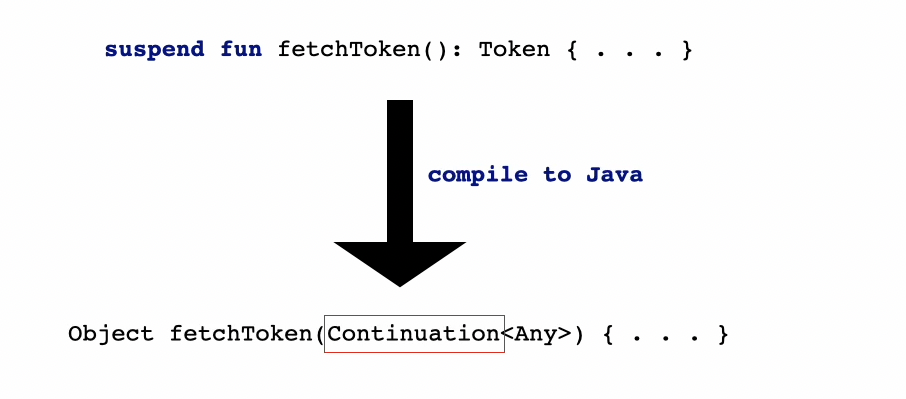
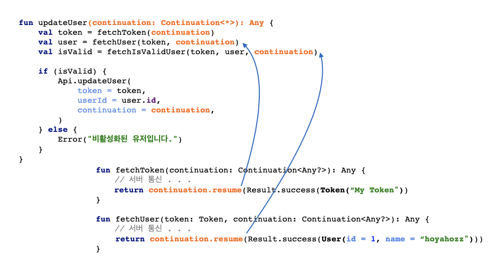
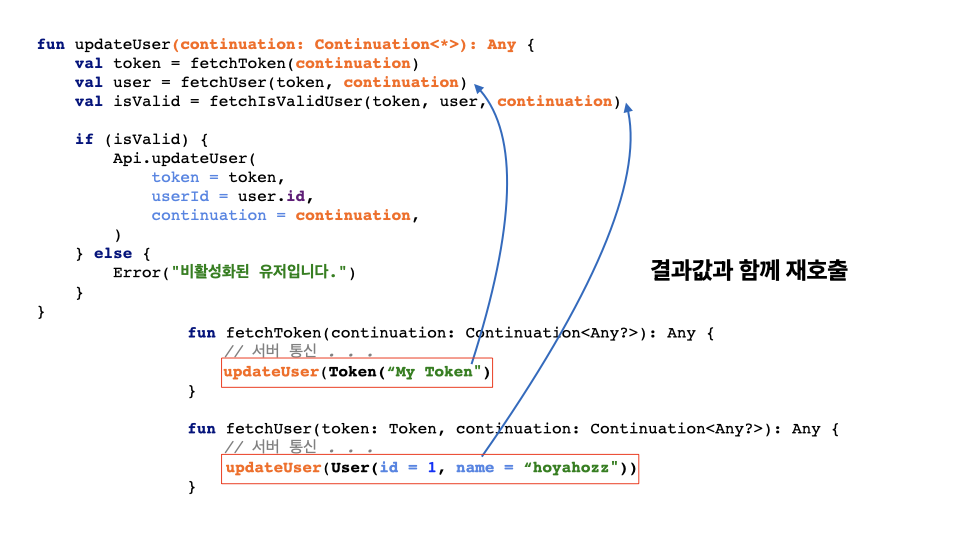
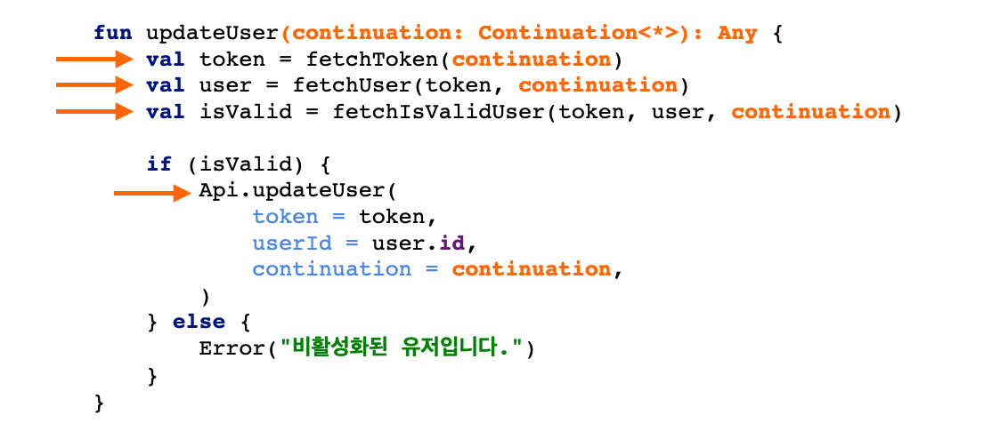
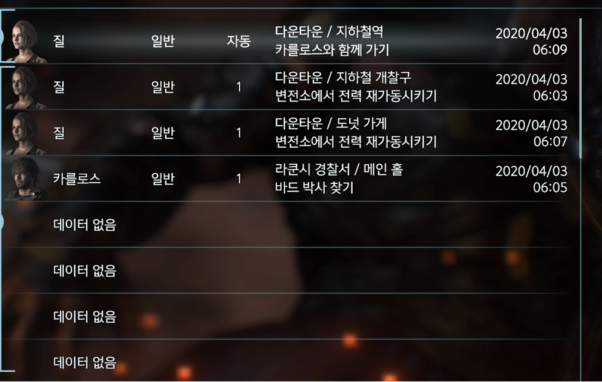
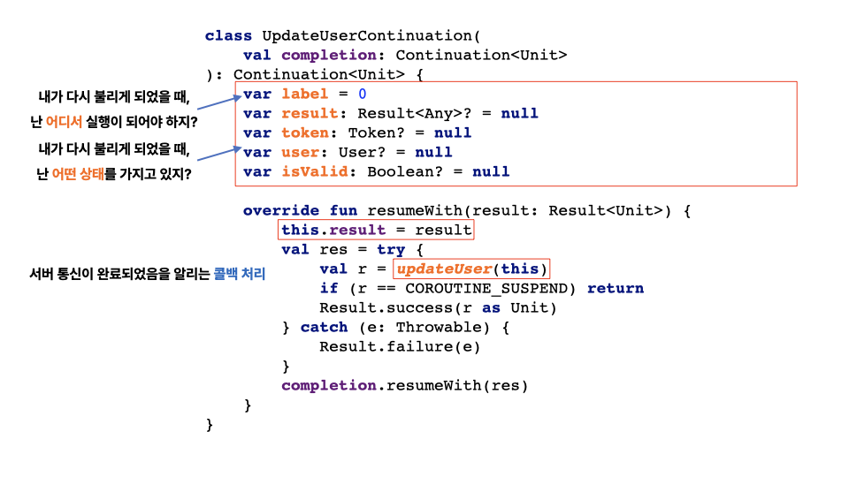

+++
title = "코루틴 내부 구조, 쉽게 뜯어보기"
date = 2025-07-01
draft = false
description = "CPS, State Machine, Labeling 관점에서 suspend 함수의 내부 동작을 쉽게 해부합니다."
tags = ["Kotlin", "Coroutines"]
+++

코틀린을 주력 언어로 사용하는 개발자라면, 비동기 처리 시에 코루틴을 습관처럼 사용하고 있을 것이다. 복잡한 설정 없이 **`suspend`** 키워드만 붙여주면, **함수가 중단되었다가 작업이 완료되는 신기한 비동기 흐름**을 간단하게 만들 수 있기 때문이다.

물론 단순히 `suspend` 키워드의 역할만 알아도 코루틴을 사용하는 데에는 아무런 문제가 없지만, 어느 순간 이런 궁금증이 들 수 있다.

> **🤔 `suspend` 가 붙은 함수는 내부에서 어떻게 동작하는걸까?**

오늘은 이러한 개발자스러운 궁금증을 해결하기 위해, 코루틴의 내부 동작을 이해하는 데 핵심이 되는 아래 **세 가지 키워드**를 중심으로 차근차근 뜯어보려 한다.

1.  **`CPS (Continuation-Passing Style)`**
2.  **`State Machine`**
3.  **`Labeling`**

세 가지 키워드의 개념들을 모두 살펴본 후에는, **코루틴을 실제로 구현**해보며 컴파일러가 어떤 코드를 만들어내는지, **`suspend`** 함수가 어떻게 상태를 기억하고 이어서 실행되는지 눈으로 확인해 볼 것이다.

---

개념 설명에 앞서 해당 포스팅에서 사용할 예제 코드는 다음과 같다.

```kotlin
fun updateUser() {
    scope.launch {
        val token = fetchToken()
        val user = fetchUser(token)
        val isValid = fetchIsValidUser(token, user)

        if (isValid) {
            Api.updateUser(
                token = token,
                userId = user.id
            )
        } else {
            Error("비활성화된 유저입니다.")
        }
    }
}

/** 토큰 조회 */
suspend fun fetchToken(): Token { . . . }

/** 유저 정보 조회 */
suspend fun fetchUser(token: Token): User { . . . }

/** 유저 유효셩 검사 */
suspend fun fetchIsValidUser(token: Token, user: User): Boolean { . . . }
```

로직 자체는 매우 단순하다.

1.  **토큰과 유저 정보**를 가져온다.
2.  가져온 데이터의 **유효성을 검사**한다.
3.  데이터가 유효하다면 **유저 정보를 업데이트**한다.

해당 예제 코드를 기반으로, 위에서 이야기한 세 가지 키워드에 대해 순서대로 살펴보자.

---

## **CPS (Continuation-Passing Style)**

`CPS` 라는 이름만 들어보았을 때는 복잡해보이지만, **사실은 우리에게 익숙한 `Callback` 과 매우 유사한 개념**이다.

아래 코드를 보면 느낌이 와닿을 것이다.

```kotlin
fun updateUser() {
   fetchToken { token ->
      fetchUser(token) { user ->
           fetchIsValidUser(token, user) { isValid ->
            if (isValid)
                Api.updateUser(token, user.id, isValid)
            else
                Error("비활성화된 유저입니다.")
         }
      }
   }
}

fun fetchToken(continuation: (token: Token) -> Unit) {
   continuation(Token("My token"))
}

// . . .
```

코드와 같이 `CPS`는 **다음 작업을 `Callback` 으로 넘겨서 이어가는 방식**이다. 함수가 결과를 리턴하지 않고, **결과를 처리할 다음 함수를 인자로 받아 실행하는 것**이 특징이다.

다만 코루틴에서의 `CPS`는 위의 코드와 완전히 동일하게 동작하진 않는다.



코루틴을 사용하는 개발자라면 이미 알고 있겠지만, **`suspend` 키워드가 붙은 함수에서는 로직을 동기 코드처럼 작성해도 실제로는 비동기 처리가 일어난다.**

그 이유는, 코루틴이 사용될 때 컴파일러가 **`suspend` 함수를 자동으로 `Continuation` 객체를 매개변수로 받는 형태로 변환**해주기 때문이다.

이러한 자동 변환 덕분에, 우리는 복잡한 `Callback` 을 직접 다루지 않고도 **간결하게 비동기 처리를 구현**할 수 있다.

하지만 일반적인 `CPS`와 코루틴 `CPS` 사이에 눈에 보이는 차이가 있는데, 일반적인 `CPS`에서는 **함수 타입을 인자로 넘기는 방식**이었다면 코루틴의 `CPS`에서는 **`Continuation` 객체가 인자로 전달**된다는 점이다.

하지만 실제로 **`Continuation` 객체 내부**를 들여다보면, **그 동작 원리는 일반적인 `CPS`와 본질적으로 크게 다르지 않음을 알 수 있다.**

```kotlin
interface Continuation<in T> {
    val context: CoroutineContext
    fun resume(value: T)
    fun resumeWithException(exception: Throwable)
}
```

**`Continuation`** 은 **`interface`** 로 구성되어 있으며, 위 코드처럼 하나의 프로퍼티와 두 개의 함수로 구성되어 있다.

이 중 **`context`** 는 현재 코루틴이 소속되어 있는 스레드, 활성화 여부 등 코루틴에 대한 다양한 정보를 담고 있는 객체이다.

하지만 핵심은 **`resume`** 과 **`resumeWithException`** 인데, 이 함수들은 **`suspend` 함수가 `Callback` 과 동일한 방식으로 다음 동작을 이어가도록 만드는 역할을 담당**한다.

쉽게 말해, **`Continuation` 은 `Callback` 과 동일하게 동작하는 `interface` 이면서, 여기에 코루틴에 대한 정보를 담고 있는 객체를 담고 있는 확장된 형태의 `Callback`** 이라고 볼 수 있다.

실제로 컴파일된 코드를 보며 좀 더 자세히 살펴보자.

```kotlin
fun updateUser(continuation: Continuation<*>): Any {
    val token = fetchToken(continuation) // suspend function
    val user = fetchUser(token, continuation) // suspend function
    val isValid = fetchIsValidUser(token, user, continuation) // suspend function

    if (isValid) {
        Api.updateUser(
            token = token,
            userId = user.id,
            continuation = continuation,
        )
    } else {
        Error("비활성화된 유저입니다.")
    }
}
```

앞서 이야기한 것처럼, **`suspend` 함수는 컴파일 시 위와 같이 `Continuation` 객체를 매개변수로 받는 형태로 변환**된다.

`fetchToken`, `fetchUser` 역시 `suspend` 함수이므로, `Continuation` 객체를 매개변수로 받는 것을 확인할 수 있다.

```kotlin
fun fetchToken(continuation: Continuation<Any?>): Any {
    // 서버 통신 . . .
    return continuation.resume(Result.success(Token("My Token"))
}

fun fetchUser(token: Token, continuation: Continuation<Any?>): Any {
    // 서버 통신 . . .
    return continuation.resume(Result.success(User(id = 1, name = "hoyahozz")))
}
```

그리고 해당 함수들의 내부를 살펴보면, 여기서 앞서 짚었던 **핵심 함수인 `resume` 이 호출되는 것을 확인**할 수 있다.



**`resume` 은 서버 통신을 마친 후 받아온 결과값을 이미지와 같이 다음 흐름으로 넘겨주는 역할**을 한다.

즉, **`Callback` 과 동일한 동작을 수행**하고 있으며, 이를 통해 **코루틴은 함수가 완료될 때마다 자동으로 다음 단계로 실행을 이어나갈 수 있게 된다.**

---

하지만 여기서 한 가지 의문이 생긴다.

> 🤔 **`resume` 으로 결과를 넘겨줄 뿐인데, 어떻게 함수가 그 다음 로직으로 이어지는거지!?**

이 의문에 대한 해답은 **`Continuation` 의 구현체 내부**에 숨어있다.

```kotlin
class UpdateUserContinuation(): Continuation<Unit> {
   override fun resume(result: Result<Unit>) {
        this.result = result
        updateUser(this)
    }
}
```

`Continuation` 의 구현체를 살펴보면, **`resume` 은 결과값을 저장한 뒤, 자신을 호출했던 `updateUser` 를 재호출하는 것**을 볼 수 있다.



즉, **코루틴은 자신이 중단됐던 함수를 그대로 재실행하는 방식으로 동작하는 것**이다.

그러면 또 다른 의문이 생긴다.



> 🤔 **함수를 다시 호출하면, 처음부터 그대로 다시 쭉 실행되는거 아닌가?  
> 🤔 어디서부터 다시 실행하는지는 어떻게 아는거지?**

바로 이 지점에서 등장하는 것이 **`Labeling`** 이라는 개념이다.

---

## **Labeling**

`Labeling` 의 역할은 아주 간단하다.

```
suspend fun updateUser() {
    // label 0
    val token = fetchToken()
    // label 1
    val user = fetchUser(token)
    // label 2
    val isValid = fetchIsValidUser(token, user)

    // label 3
    if (isValid) {
        Api.updateUser(
            token = token,
            userId = user.id
        )
    } else {
        Error("비활성화된 유저입니다.")
    }
}
```

위 코드처럼, **`suspend` 함수를 만나는 지점마다 컴파일러는 `Continuation` 내부에 `label` 값을 설정**한다.  
즉, **중단 지점이 어디였는지를 저장하는 역할**을 하는 것이다.



이는 **게임의 세이브 포인트**와 매우 유사한 개념으로, **`resume` 을 통해 `suspend` 함수가 다시 실행될 때 어디서부터 로직을 전개할지 알려주는 주는 표지판 역할**을 한다.

실제 컴파일된 코드를 살펴보면 좀 더 명확하게 이해할 수 있다.

```kotlin
fun updateUser(continuation: Continuation<*>): Any {
   when (continuation.label) {
       0 -> { 
           continuation.label = 1
           fetchToken(continuation)
       }
       1 -> {
           continuation.label = 2
           fetchUser(token, continuation)
       }
       2 -> { 
           continuation.label = 3
           fetchIsValidUser(token, user, continuation)
       }
       3 -> { . . . }
       4 -> { . . . }
   }
}

class UpdateUserContinuation(): Continuation<Unit> {
    var label = 0
    override fun resumeWith(result: Result<Unit>) { . . . }
}
```

코드를 보면, 함수가 실행될 때마다 `Continuation`에 저장된 `label` 값을 기준으로 **어느 지점에서 실행을 재개해야 하는지 분기 처리**가 이루어짐을 알 수 있다.

-   처음 함수에 진입한다면 `label` 을 1번으로 설정하고, 토큰을 가져온다.
-   두 번째로 진입한다면 `label` 을 2번으로 설정하고 유저 정보를 가져온다.
-   같은 방식으로 다음 단계를 이어나간다.

이러한 방식으로 **각 중단 지점을 기준으로 로직이 분기되고, 이전 작업의 결과를 받아 실행 흐름을 이어갈 수 있게 되는 것**이다.

---

그렇다면 이 타이밍에 궁금증이 하나 더 생긴다.

> 🤔 **두 번째 호출된 시점에서는 어떻게 토큰 값을 알고 있는거지?**

여기서 등장하는 것이 **`State Machine`** 이다.

---

## **State Machine**

이름 그대로, **함수 호출에 필요한 상태를 저장하고 관리하는 역할**을 한다.

```kotlin
class UpdateUserContinuation(): Continuation<Unit> {
    var label = 0
    var result: Result<Any>? = null
    var token: Token? = null // 토큰
    var user: User? = null // 유저 정보
    var isValid: Boolean? = null // 유효성 검사 결과

    override fun resumeWith(result: Result<Unit>) { . . . }
}
```

위 예시처럼, **필요한 모든 상태 값들은 `Continuation` 내부에 저장**된다.

```kotlin
fun updateUser(continuation: Continuation<*>): Any {
    val continuation = continuation as? UpdateUserContinuation 
         ?: UpdateUserContinuation(continuation) // State Machine 생성

    val token = fetchToken(continuation)
    val user = fetchUser(token, continuation)
    val isValid = fetchIsValidUser(token, user, continuation)

    // . . .
}
```

`suspend` 함수가 **처음 호출되는 시점에는 `Continuation` 인스턴스가 생성**되고, **이후에는 해당 인스턴스를 계속 재사용**하게 된다.

따라서 두 번째 호출부터는 **이미 저장해두었던 상태를 그대로 꺼내 재사용할 수 있다.**

해당 개념도 컴파일된 코드를 보며 명확하게 이해해보자.

```kotlin
fun updateUser(continuation: Continuation<*>): Any {
   when (continuation.label) {
       0 -> {
           continuation.result = fetchToken()
       }
       1 -> {
           continuation.token = continuation.result as Token
           continuation.result = fetchUser(continuation.token)
       }
       2 -> {
           continuation.user = continuation.result as User
           continuation.result = fetchIsValidUser(
               continuation.token, continuation.user
           )
       }
       3 -> { . . . }
       4 -> { . . . }
   }
}
```

앞서 저장했던 `label` 값에 따라 분기가 발생하고, **해당 지점에서 이전에 저장해두었던 값을 꺼내 로직을 이어가는 방식**임을 확인할 수 있다.

-   처음 함수에 진입한다면 토큰을 가져오고, 이를 `result` 에 저장한다.
-   두 번째 함수에 진입한다면 `result` 에 토큰이 저장되어 있으므로, 그대로 꺼내 사용한다.
-   같은 방식으로 다음 단계를 이어나간다.

---

지금까지 살펴본 내용을 종합해보면, **`Continuation` 내부에 코루틴과 관련된 모든 비밀이 숨겨져 있었다는 사실을 알 수 있다.**



-   `resumeWith` 는 작업이 완료된 후 다시 함수를 호출하여 다음 로직을 이어나간다. **(`CPS`)**
-   저장된 `label` 값을 통해 현재 실행해야 할 위치를 저장하고 분기 처리한다. **(`Labeling`)**
-   토큰, 유저 정보 등 이전 단계에서 만들어진 데이터를 저장해두고, 이후 단계에서 그대로 재사용할 수 있게 한다.  
    **(`State Machine`)**

결국 이 세 가지 개념이 유기적으로 맞물리면서, **우리가 아무렇지 않게 작성한 동기 코드가 실제로는 복잡한 비동기 흐름을 따라 실행될 수 있도록 만들어주는 것**이다.

---

## **직접 구현해보기**

이제 코루틴이 내부에서 어떤 개념들을 바탕으로 동작하는지 이해했으니, 직접 구현해보며 개념을 다시 복습해보자.

```kotlin
fun updateUser(continuation: Continuation<*>): Any {
    val continuation = continuation as? UpdateUserContinuation
        ?: UpdateUserContinuation(continuation)
}
```

함수 내에서 사용할 상태와 `label` 을 저장하기 위해 `Continuation` 을 초기화한다.

```kotlin
fun updateUser(continuation: Continuation<*>): Any {
   val continuation = continuation as? UpdateUserContinuation 
       ?: UpdateUserContinuation(continuation)

   when (continuation.label) {
       0 -> { }
       1 -> { }
       2 -> { }
       3 -> { }
       4 -> { }
   }
}
```

이후 `label` 에 따른 분기 처리를 준비한다.

```kotlin
fun updateUser(continuation: Continuation<*>): Any {
   when (continuation.label) {
       0 -> {
           continuation.label = 1
           fetchToken(continuation)
       }
       1 -> { }
       2 -> { }
       3 -> { }
       4 -> { }
   }
}
```

함수에 최초로 진입한 경우 `label` 을 1번으로 만들어주고, 토큰을 가져온다.

```kotlin
fun updateUser(continuation: Continuation<*>): Any {
   when (continuation.label) {
       0 -> { . . . }
       1 -> {
           val token = continuation.result as Token

           continuation.token = token
           continuation.label = 2

           fetchUser(token, continuation)
       }
       2 -> { }
       3 -> { }
       4 -> { }
   }
}
```

두 번째로 진입한 경우 이전에 저장한 토큰 정보를 가져오고, 가져온 토큰을 통해 유저 정보를 가져온다.

물론, `label` 과 `token` 값 역시 `Continuation` 내부에 저장시킨다.

```kotlin
fun updateUser(continuation: Continuation<*>): Any {
   when (continuation.label) {
       0 -> { . . . }
       1 -> { . . . }
       2 -> {
           val user = continuation.result as User

           continuation.user = user
           continuation.label = 3

           fetchIsValidUser(continuation.token, user, continuation)
       }
       3 -> { }
       4 -> { }
   }
}
```

세 번째 진입한 경우 이전에 저장한 유저 정보를 가져오고, `Continuation` 에 저장되어 있는 토큰과 가져온 유저 정보를 통해 유효성 검사를 진행한다.

```kotlin
fun updateUser(continuation: Continuation<*>): Any {
   when (continuation.label) {
       . . .
       3 -> {
           val isValid = continuation.result as Boolean

           continuation.isValid = isValid

           if (isValid) {
               continuation.label = 4

               Api.updateUser(
                   token = continuation.token,
                   userId = continuation.user.id,
                   continuation = continuation
               )
           } else {
               Error("비활성화된 유저입니다.")
           }
       }
       4 -> { 
         return Unit
       }
   }
}
```

마지막으로 이전에 가져온 유효성 검사 결과에 따라 유효하다면 `Continuation` 에 저장된 토큰, 유저 데이터를 이용하여 유저 정보를 업데이트한다.

전체 코드는 다음과 같다.

```kotlin
fun updateUser(continuation: Continuation<*>): Any {
   val continuation = continuation as? UpdateUserContinuation ?: UpdateUserContinuation(continuation)

   when (continuation.label) {
       0 -> {
           continuation.label = 1
           val res = fetchToken()
           if (res == COROUTINE_SUSPEND) {
               return COROUTINE_SUSPEND
           }
       }
       1 -> {
           val token = continuation.result!!.getOrThrow() as Token

           continuation.token = token
           continuation.label = 2

           val res = fetchUser(token)
           if (res == COROUTINE_SUSPEND) {
               return COROUTINE_SUSPEND
           }
       }
       2 -> {
           val user = continuation.result!!.getOrThrow() as User

           continuation.user = user
           continuation.label = 3

           val res = fetchIsValidUser(continuation.token, user)
           if (res == COROUTINE_SUSPEND) {
               return COROUTINE_SUSPEND
           }
       }
       3 -> {
           val isValid = continuation.result!!.getOrThrow() as Boolean

           continuation.isValid = isValid

           if (isValid) {
               continuation.label = 4

               val res = Api.updateUser(token, user.id)
               if (res == COROUTINE_SUSPEND) {
                   return COROUTINE_SUSPEND
               }
           } else {
               Error("비활성화된 유저입니다.")
           }
       }
       4 -> {
           return Unit
       }
   }
}
```

---

지금까지 코루틴의 내부 동작을 구성하는 세 가지 핵심 개념을 모두 살펴보고, 실제 구현까지 진행해보았다.

물론 실제 컴파일된 코드는 훨씬 더 복잡하고 길지만, 이론을 이해하는 데에는 이 정도 수준만으로도 충분하다고 생각한다.

이 과정을 통해 `suspend` 함수가 어떻게 중단되고, 다시 재개되며, 얼핏 보기엔 단순한 동기 코드처럼 보이지만 실제로는 어떻게 비동기 처리를 수행하는지를 직접 확인할 수 있었다.

---

**References**

[Kotlin Coroutines - Marcin Moskala](https://product.kyobobook.co.kr/detail/S000044428865)</br>
[KotlinConf 2017 - Deep Dive into Coroutines on JVM by Roman Elizarov](https://www.youtube.com/watch?v=YrrUCSi72E8 "KotlinConf 2017 - Deep Dive into Coroutines on JVM by Roman Elizarov")</br>


