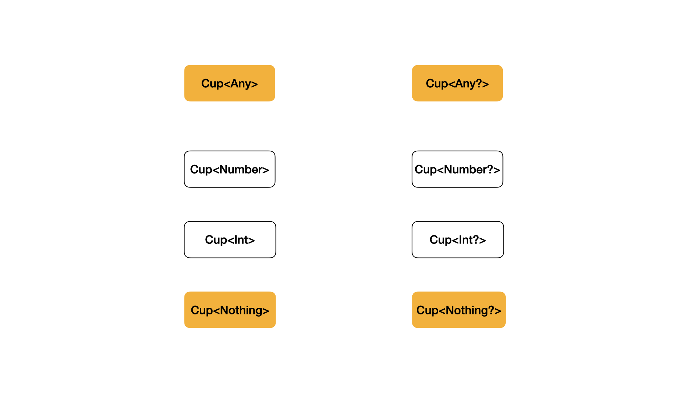
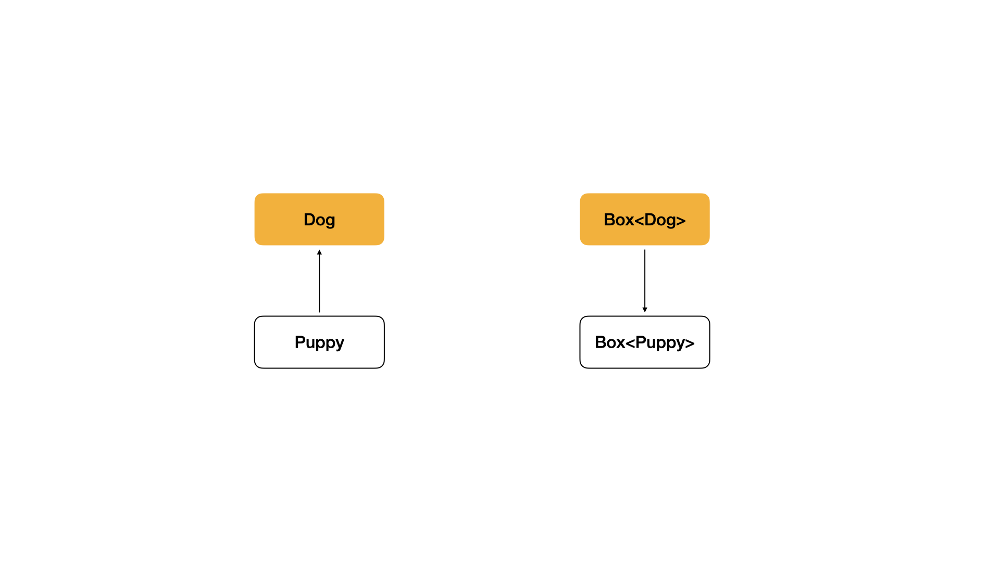

+++
title = "Kotlin Generic in, out"
date = 2024-01-07
draft = false
tags = ["Kotlin", "Generic"]
series = ["Kotlin Generic"]
+++

[지난 포스팅](/posts/kotlin-generic/)에서는 제네릭의 기초적인 내용들을 알아보았다. 이번 포스팅에서는 한 발 더 나아가 심화적인 내용들을 알아보도록 하자.

## 제네릭은 기본적으로 불변(invaraint)하다

```kotlin
fun main() {
	val any: Any = 5 // 업캐스팅
}
```

위의 코드가 컴파일 오류 없이 잘 동작하는 이유는 무엇일까?

`5` 라는 값은 기본적으로 `Int` 타입이다. 그리고 **`Int` 는 `Any` 의 서브 타입**이기 때문에 값이 할당되는 과정에서 **`5` 는 자동적으로 `Any` 타입으로 변환**된다. 즉, **`Any`, `Int` 는 부모-자식 간의 관계**를 지니고 있기 때문에 코틀린 타입 변환에 의해 자동으로 업캐스팅되어 정상적으로 작동한다.

```kotlin
class Cup<T>

fun main() {
    val anyCup: Cup<Any> = Cup<Int>() // 컴파일 에러
}
```

하지만, **제네릭을 사용하면 앞의 예제와 다르게 컴파일 에러가 발생**한다. 이는, **제네릭이 불변(invariant) 특성을 지니고 있기 때문**이다. 아래의 이미지를 보자.


코틀린의 기본 타입들은 기본적으로 위와 같이 관계를 지니고 있다. 즉, **`Int` 는 `Any` 의 서브 타입이다.**



하지만, 제네릭 타입은 관계를 전혀 지니고 있지 않다. 즉, **`Cup<Int>` 는 `Cup<Any>` 의 서브 타입이 아니다.** 이러한 설계는 코틀린을 배우는 개발자들에게 혼동을 초래하긴 하지만, **컴파일 시점에서 오류를 캐치하는 데 큰 도움**을 준다. 코틀린 제네릭 공식 문서에 기재된 예제를 살펴보자.

```kotlin
fun main() {
    val strs: ArrayList<String> = ArrayList()
    val objs: ArrayList<Any> = strs // 컴파일 에러가 발생하지 않는다면?
    
    objs.add(1)
    
    val s: String = strs[0] // ClassCastException: Cannot cast Integer to String
}
```

위 예제는 기존 타입 시스템과 비슷하게 **`ArrayList<String>` 이 `ArrayList<Any>` 의 서브 타입이라고 가정**한다. 예제의 로직 진행 순서는 다음과 같다.

1. `ArrayList<String>` 은 `ArrayList<Any>` 의 서브 타입이므로 **`objs`에 `strs` 를 할당할 수 있게 된다.**
2. `objs` 에 `Int` 타입의 값을 추가한다. **이 때, `strs` 에도 동일한 값이 저장**된다.
3. `strs` 는 `ArrayList<String>` 으로 타입이 명시되었기 때문에, 훗날 **다른 개발자가 값을 사용할 때 `String` 타입으로 명시한 후 사용**한다.
4. **그러나 실제로는 `1` 이 삽입되어 있는 상태이므로 `s` 에 값을 할당하는 과정에서 `ClassCastException` 이 발생**한다.

이러한 사태를 방지하기 위해, **제네릭은 기본적으로 불변으로 설계**되어 있다. **제네릭 타입의 인스턴스에 예상치 못한 타입의 객체가 주입되는 것을 방지하여 타입 안정성을 향상시키는 것**이다.

하지만 때로는 **제네릭 사이의 관계를 명확히 정립하여 코드 재사용성을 높여야 하는 경우**가 있다.

---

## 제네릭 사이의 관계 정립

**제네릭 사이의 관계를 정립**하기 위해선, **제네릭 타입에 대한 변성을 지정**해주어야 한다. 이를 위해 **선언처 변성 (Declaration-site Variance) 혹은 타입 프로젝션(Type projection)을 사용**할 수 있다.

</br>

### 선언처 변성 (Declaration-site Variance)

```kotlin
class CovariantBox<out T>
class class ContravariantBox<in T>
interface Box<out T>

fun main() {
    val anyBox: CovariantBox<Number> = CovariantBox() 
    // 선언된 순간 CovariantBox<out Number> 로 확정됩니다.
}
```

선언처 변성은 위와 같이 제네릭 타입의 **변성(variance)을 클래스, 인터페이스의 선언 지점에서 정의할 수 있는 기능을 의미**한다. **선언과 동시에 해당 타입만을 사용하도록 강제되어 일관성을 유지**할 수 있게 해준다. 

여기서 `out`, `in` 키워드가 나오는데, 이에 대해서는 아래 목차에서 더 자세히 살펴보도록 한다.

</br>

### 타입 프로젝션 (Type projection)

```kotlin
fun main() {
    val strings: Array<String> = arrayOf("Hello", "World")
    val anys: Array<Any> = Array(2) { "" }
    copy(strings, anys)

    val ints: Array<Int> = arrayOf(1, 2)
    copy(ints, anys) // 사용하는 순간마다 다른 타입의 배열 주입이 가능합니다.
}
```

타입 프로젝션도 선언처 변성과 크게 다를 점은 없지만, **선언 지점이 아닌 사용 지점에서 제네릭 타입의 변성을 정의할 수 있는 기능을 의미**한다. 선언처 변성과 달리 **사용할 때만 변성이 적용되므로, 유연하게 변성을 조정할 수 있다는 장점**이 있다.

---

## 변성의 종류

변성은 크게 **공변성(covariant)**과 **반공변성(contravaraint)**으로 나누어진다. 단어부터가 이미 난해하지만, 예제 코드를 보며 천천히 이해해보도록 하자.

</br>

### 공변성(covariant, out)

**공변성은 `A` 가 `B` 의 서브 타입일 때, `Class<A>` 가 `Class<B>` 의 서브 타입**이라는 의미를 담고 있다. 코틀린에서는 **`out` 키워드를 통해 타입 파라미터가 공변성을 지니도록 구현**할 수 있다.

```kotlin
open class Dog

open class Puppy: Dog()
class Hound: Dog()
```

위와 같이 서로 관계를 가지고 있는 클래스가 있다고 가정하자. **`Puppy`, `Hound` 는 현재 `Dog` 의 서브 타입**이다.

```kotlin
class Box<out T> { . . . }
```

그리고 클래스 `Box` 에 **`out` 키워드와 함께 타입 파라미터를 선언**함으로써, **타입 파라미터가 공변성을 지니도록 구현**하였다.

```kotlin
fun main() {
    val puppyBox: Box<Puppy> = Box()
    val dogBox: Box<Dog> = puppyBox // 업캐스팅
    
    val puppy = Puppy()
    val dog = puppy // 업캐스팅
}
```

이후 실제 사용한 모습이다. 일반적인 타입 시스템 설계와 동일하게, **`Box<Puppy>` 가 `Box<Dog>` 의 서브 타입이 된 것을 확인**할 수 있다. `Box<Puppy>` 타입의 변수를 `Box<Dog>` 타입의 변수에 할당시키는 과정에서 업캐스팅이 발생한다.


이미지로 보면 관계를 더 쉽게 이해할 수 있다. 정말 기존의 타입 시스템과 하나도 다르지 않은 모습을 확인할 수 있다. 여기서 한 발 자국 더 나아가보자.

```kotlin
class Box<out T> {
    private var value: T? = null

	// 컴파일 에러
    fun set(value: T) { 
        this.value = value 
    }

    fun get(): T = value ?: error("")
}
```

클래스를 좀 더 구현한 모습이다. 주석의 내용과 같이, `set` 메소드는 컴파일 에러가 발생하지만, `get` 메소드는 정상적으로 실행되는 것을 확인할 수 있다. **왜 `set` 메소드는 에러가 발생하는걸까?** 다시 가정법을 통해 알아보자.

```kotlin
open class Dog

open class Puppy: Dog()
class Hound: Dog()

fun main() {
    val puppyBox: Box<Puppy> = Box()
    val dogBox: Box<Dog> = puppyBox // 업캐스팅

    dogBox.set(Hound())

    val gotValue: Puppy = puppyBox.get()
    // 하지만 실제로는 Hound 가 들어있으므로 오류가 발생합니다.
}
```

만약 **`set` 메소드에서 컴파일 에러가 발생하지 않았다고 가정**하면, 위의 코드는 문제없이 빌드에 성공한다. 코드의 로직 전개는 다음과 같다.

1. `Box<Puppy>` 는 `Box<Dog>` 의 서브 타입이므로 **`dogBox` 에 `puppyBox` 를 할당**할 수 있다.
2. **`Hound` 는 `Dog` 의 서브 타입**이므로 **`dogBox` 의 `set` 메소드의 파라미터로 선언**할 수 있다.
3. `set` 메소드로 인해 **`puppyBox` 에 `Hound` 가 주입**된다.
4. 훗날 다른 개발자가 `puppyBox` 에서 `get` 메소드를 통해 **`Puppy`** 를 꺼내오려 한다.
5. **하지만 실제로는 `Hound` 가 리턴되어 런타임 환경에서 오류가 발생한다.**

이러한 사태를 방지하기 위해 **`out` 키워드와 함께 타입 파라미터를 선언한 클래스**에서는 **메소드의 파라미터로 타입 파라미터를 선언하지 못하도록 강제**한다.

이 법칙을 좀 더 생각해보면, **`out` 타입 파라미터가 선언된 클래스에서는 오로지 반환값만을 사용할 수 있음을 의미**함을 알 수 있다. 이로 인해 **해당 클래스 내의 값들이 변경되거나, 추가되는 일이 절대 없다는 것이 보장된**다.

```kotlin
public interface List<out E> : Collection<E>
```

**`out` 의 좋은 예시로는 `List`** 를 꼽을 수 있다. 평소에 많이 사용해서 알겠지만, **`List` 내부의 값은 절대로 변하지 않음을 보장**하기 때문에 사용하는 입장에서 `List` 타입의 인스턴스를 안정적으로 사용할 수 있다.

</br>

### 반공변성 (contravariant, in)

**반공변성은 `A` 가 `B` 의 서브 타입일 때, `Class<B>` 가 `Class<A>` 의 서브 타입이라는 의미**를 담고 있다. 코틀린에서는 **`in` 키워드를 통해 타입 파라미터가 반공변성을 지니도록 구현**할 수 있다.

```kotlin
open class Dog
interface ForeignDog

open class Puppy : Dog(), ForeignDog
```

위와 같이 관계를 지니고 있는 클래스가 있다. **`Puppy` 는 `Dog`, `ForeignDog` 의 서브 타입**이다.

```kotlin
class Box<in T> { . . . }
```

클래스 `Box` 에 `in` 키워드와 함께 타입 파라미터를 선언함으로써, 타입 파라미터가 반공변성을 지니도록 구현하였다.

```kotlin
fun main() {
    val dogBox: Box<Dog> = Box()
    val puppyBox: Box<Puppy> = dogBox // 업캐스팅
}
```

이후 실제 사용한 모습이다. **공변성과는 달리 `Puppy` 가 최상위 타입이 된 모습을 확인**할 수 있다. `Box<Dog>` 타입의 변수를 `Box<Puppy>` 타입의 변수에 할당하는 과정에서 업캐스팅이 발생한다.



이미지로 보면 위와 같은 관계가 성립된다. 공변성을 다룰 때와 동일하게, 한 발자국 더 나아가보자.

```kotlin
class Box<in T> {
    private var value: T? = null

    fun set(value: T) {
        this.value = value
    }

	// 컴파일 에러
    fun get(): T = value ?: error("")
}
```

이번에는 `set` 메소드가 아닌 **`get` 메소드에서 오류가 발생**한다. 이에 대한 원인도 가정법을 통해 알아보자.

```kotlin
open class Dog
interface ForeignDog

open class Puppy : Dog(), ForeignDog

fun main() {
    val dogBox: Box<Dog> = Box()
    val puppyBox: Box<Puppy> = dogBox // 업캐스팅

    dogBox.set(Dog())

    val gotValue: ForeignDog = puppyBox.get() // 업캐스팅
    // 하지만 실제로는 Dog 이 들어있으므로 오류가 발생합니다.
}
```

만약 **`get` 메소드에서 컴파일 에러가 발생하지 않았다고 가정**하면, 위의 코드는 문제없이 빌드에 성공한다. 코드의 로직 전개는 다음과 같다.

1. `Box<Dog>` 은 `Box<Puppy>` 의 서브 타입이므로 **puppyBox 에 DogBox 를 할당**할 수 있다.
2. `dogBox` 에 `Dog` 인스턴스를 주입한다.
3. **`ForeignDog` 은 `Puppy` 의 상위 타입이므로, `puppyBox` 에서 업캐스팅을 통해 값을 꺼내올 수 있다.**
4. 훗날 다른 개발자가 `puppyBox` 에서 get 메소드를 통해 `ForeignDog` 을 꺼내오려 한다.
5. 하지만 실제로는 **`Dog` 이 리턴되어 런타임 환경에서 오류가 발생**한다.

이러한 사태를 방지하기 위해 **`in` 키워드와 함께 타입 파라미터를 선언한 클래스**에서는 **메소드의 리턴 타입으로 타입 파라미터를 선언하지 못하도록 강제**한다.

마찬가지로 이 법칙을 좀 더 생각해보면, **`in` 타입 파라미터가 선언된 클래스에서는 오로지 값을 추가하거나 변경할 수 있음을 의미**한다.

```kotlin
interface Comparable<in T> {
    operator fun compareTo(other: T): Int
}

fun demo(x: Comparable<Number>) {
    x.compareTo(1.0) // 1.0은 Double 타입으로, Number 의 서브 타입입니다.
	// 따라서, Number 타입의 x 를 할당할 수 있습니다.
    val y: Comparable<Double> = x // OK!
}
```

`in` 의 좋은 예시로는 **`Comprable`** 를 꼽을 수 있다.

---

이번 포스팅에서는 불변성, 변성, 공변성, 반공변성에 대해 자세히 알아보았다. 이러한 변성은 선언하거나 사용할 때 타입을 정확히 알고 있어야만 사용할 수 있다. 하지만 **타입을 정확히 알지 못하는 경우에도 제네릭을 사용해 타입 안정성을 보장받고 싶은 경우**가 있는데, 이에 대한 개념은 다음 포스팅에서 이어서 알아보도록 한다.

---

**References**

[코틀린 공식 문서](https://kotlinlang.org/docs/generics.html)
[이펙티브 코틀린: 아이템 24 - 제네릭 타입과 variance 한정자를 활용하라](https://product.kyobobook.co.kr/detail/S000001033129)

