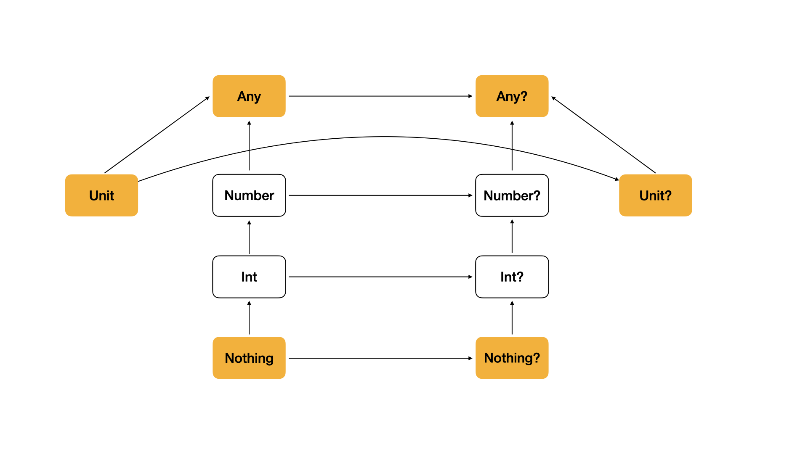

+++
title = "Kotlin Generic"
date = 2023-12-10
draft = false
description = "코틀린 제네릭의 기본 개념과 타입 파라미터 사용 이유를 기초부터 정리합니다."
tags = ["Kotlin", "Generic"]
series = ["Kotlin Generic"]
+++

## Generic ?

제네릭은 함수에 파라미터를 전달하는 것과 유사하게 **타입에 파라미터를 전달**해 **컴파일 시에 적합한 타입을 사용할 수 있게 지정하는** 것을 의미한다. 이로 인해 **타입 안정성을 강화**할 수 있는 것은 물론, **코드 재사용성**을 높이는 효과를 누릴 수 있다. 아래 코드를 보며 제네릭에 대해 가볍게 이해해보자.

```kotlin
fun printStringList(list: List<String>) {
    list.forEach { item ->
        println(item)
    }
}

fun printIntList(list: List<Int>) {
    list.forEach { item ->
        println(item)
    }
}

```

아주 간단하게 **`List` 의 타입을 파라미터로 받아 콘솔로 출력하는 함수**이다. 크게 문제는 없지만, 만약 여기서 `Float`, `Double` 타입의 `List` 를 출력하고 싶다면, **새로운 함수를 작성**해야 한다.

```kotlin
fun <T> printList(list: List<T>) {
    list.forEach { item -> 
        println(item)
    }
}

fun main() {
    val doubleList = listOf<Double>(1.0, 2.0, 3.0)
    val floatList = listOf<Float>(1.0f, 2.0f, 3.0f) 

    printList(doubleList)
    printList<Float>(floatList) // 타입 추론이 가능하므로 <Float> 을 생략할 수 있다.
}
```

하지만 여기서 **앵글 브래킷(`<>`) 사이에 타입 파라미터를 입력**하면, **새로운 함수를 작성하지 않더라도 여러 타입의 `List` 를 손쉽게 출력**할 수 있다. 이렇게 **타입 파라미터를 갖는 함수를 제네릭 함수**라고 한다.

```kotlin
class Box<T, V>(
    param: T,
    value: V
) // 타입 파라미터를 두 개 지정할 수 있다.

interface Repository<T> {
    fun fetchData()
}

```

또한, 제네릭은 함수 뿐 아니라 **클래스와 인터페이스**에서도 사용할 수 있다. 이러한 경우에서는 각각 **제네릭 클래스, 제네릭 인터페이스**라는 이름을 갖게 된다.

---

### 타입 안정성과 코드 재사용성

제네릭에 대한 기본적 개념은 아주 쉽게 이해할 수 있었다. 그렇다면, 제네릭과 타입 안정성, 코드 재사용성은 어떠한 연관 관계가 있을까? 먼저 **타입 안정성의 이점**을 누릴 수 있는 예제 코드를 살펴보자.

```kotlin
class Box<T> {
    private val contents: MutableList<T> = mutableListOf()

    fun setContent(content: T) {
        contents.add(content)
    }

    fun getLastContent(): T {
        return contents.last()
    }
}

fun main() {
    val stringBox = Box<String>()
    stringBox.setContent("content 01")
    stringBox.getLastContent()
    
    stringBox.setContent(01) // 컴파일 에러, 문자열 타입을 사용해야 한다.
}

```

앞서 이야기한 개념을 토대로 **`Box` 는 제네릭 클래스**임을 확인할 수 있다. 그리고 **`stringBox` 는 해당 클래스를 선언하며 `String` 타입을 사용할 것임을 명시**한다. 

**이 순간부터 `stringBox` 는 `Box<String>` 으로 타입이 명시**되며, 자연스럽게 **클래스 휘하의 메소드들은 `String` 타입의 파라미터만을 사용할 수 있도록 강제**된다. 이러한 이유로 `setConetnt` 메소드에 `Int` 타입의 파라미터를 주입한다면, 컴파일 에러가 발생한다.

만약 **다른 타입의 파라미터를 주입했을 때 컴파일 에러가 발생하지 않는다면** 어떻게 될까?

```kotlin
class Box<T> {
    private val contents: MutableList<T> = mutableListOf()

    fun setContent(content: T) {
        contents.add(content) // 컴파일 에러가 발생하지 않는다면?
    }

    fun getLastContent(): T {
        return contents.last()
    }
}

fun main() {
    val stringBox = Box<String>()
    stringBox.setContent(10) // 컴파일 에러가 발생하지 않는다면?
    val str: String = stringBox.getLastContent() // 런타임 에러, ClassCastException
}

```

**누군가 모종의 이유로 `stringBox` 에 정수값을 넣었다고 가정**해보자. 사용하는 개발자 입장에서 생각해보면, `stringBox` 의 타입은 `Box<String>` 이기 때문에 **안의 내용물 역시 `String` 타입의 값일 것이라고 기대할 것**이다. 하지만 **막상 꺼내보니 엉뚱하게도 정수값이 출력됐고, 타입을 명시했던 개발자는 런타임 에러**를 경험하게 된다.

제네릭은 이렇게 불확실한 런타임 에러를 미연에 방지하고자 **개발 중 특정 타입을 사용하도록 강제**한다. 이를 통해 **코드의 신뢰성을 향상**시키는 것은 물론, **개발자는 타입에 대한 확신을 얻음으로써 안정성 있는 개발을 진행할 수 있게 되는 것**이다.

</br>

**코드 재사용성이 향상**되는 것은 처음 개념을 설명할 때 사용했던 예제로 충분히 유추할 수 있었을 것이다.

```kotlin
fun <T> printList(list: List<T>) {
    list.forEach { item -> 
        println(item)
    }
}

fun main() {
    val doubleList = listOf(1.0, 2.0, 3.0)
    val floatList = listOf(1.0f, 2.0f, 3.0f) 

    printList(doubleList)
    printList(floatList)
}
```

`printList` 함수는 제네릭 함수로, **어떠한 타입의 `List` 가 들어오더라도 로직을 유연하게 처리**할 수 있다. 이 덕분에 `Double` 형태의 `List` 를 출력하는 함수, `Float` 형태의 `List` 를 출력하는 함수를 따로 생성할 필요 없이, 단 **하나의 함수로 모든 타입의 `List` 를 출력**함으로써 **재사용성을 높이고 코드를 간결하게 구성**할 수 있다.

---

### 타입 제한

제네릭은 **타입에 대한 유연성을 제공**한다는 것을 위 예제들을 통해 알 수 있었다. 하지만, 어떠한 상황에서는 **타입에 약간의 제한을 걸어야 하는 경우**가 있을 수 있다. 아래의 예제를 보자.

```kotlin
class Calculator<T> {
    fun add(param1: T, param2: T): Int {
        return param1.toInt() + param2.toInt() // 컴파일 에러
        // Any + Any?
    }
}

```

`Calculator<T>` 클래스는 **두 개의 파라미터를 받아 더하기 연산을 수행한 후 결과를 정수로 반환하는 메소드**를 가지고 있다. 그러나, **`Calculator` 클래스의 `T` 타입이 구체적으로 정의되지 않았으므로 `param1` 과 `param2` 를 `Int` 로 변환하는 것이 불가능한 상태**이다. 

이는 **타입이 명확하지 않은 상태에서 특정 타입으로의 변환을 시도했기 때문에 발생한 오류**이다. 단순하게 타입이 `Any` 로 정해졌다고 가정했을 때, `Int` 로 타입 변환이 가능한지 생각해보면 쉽게 이해할 수 있는 문제이다.

좀 더 유연한 로직 전개를 위해 **타입의 제한이 필요**한 상황이다.

```kotlin
class Calculator<T: Number> {
    fun add(param1: T, param2: T): Int {
        return param1.toInt() + param2.toInt()
    }
}

fun main() {
    val calculator = Calculator<Double>()
    val calculator2 = Calculator<String>() // 컴파일 에러
    val result = calculator.add(2.0, 3.0)
    println(result) // 5
}
```

코틀린에서는 타입 파라미터의 제한을 아주 쉽게 걸 수 있다. **단순하게 콜론(`:`) 과 함께 타입을 명시하면, 타입 파라미터 `T` 는 명시한 타입으로 제한**된다.

위 코드를 보면 `Number` 타입으로 제한을 건 상태에서 **`Number` 타입의 자식 타입들은 타입 파라미터로 선언이 가능**한 반면, **`String` 타입은 `Number` 와 아무런 관련이 없기 때문에 타입 파라미터 선언이 불가능한 것을 확인**할 수 있다.

</br>

여기서 한 발 더 나아가 생각해보면, **코틀린 타입 시스템과 제네릭 타입 제한을 혼합 활용해 `Not-nullable` 한 데이터만을 파라미터로 받아들일 수 있도록 선언**할 수 있다.



위 이미지는 **코틀린 타입 시스템**을 정리한 내용을 담고 있다. **주요 포인트는 `Not-nullable` 한 타입들이 `Any` 타입을 상속받고 있다는 점**으로, 이를 활용하면 다음과 같이 코드를 구성할 수 있다.

```kotlin
fun <T: Any> printList(list: List<T>) {
    list.forEach { item ->
        println(item)
    }
}

fun main() {
    val doubleList = listOf<Double>(1.0, 2.0, 3.0)
    val floatList = listOf<Float?>(1.0f, 2.0f, 3.0f)

    printList(doubleList)
    printList(floatList) // 컴파일 에러
}
```

**`Any` 타입으로 제네릭 타입을 제한**함으로써 **`nullable` 한 타입을 담고 있는 리스트는 파라미터로 선언할 수 없도록 구현**하였다. 이러한 방법을 통해 **런타임 환경에서 NPE가 발생하는 것을 방지하여 더 안정성 있는 애플리케이션을 구축**할 수 있다.

---

이렇게 코틀린 제네릭의 매우 기초적인 개념들을 가볍게 살펴보았다. [다음 포스팅](/posts/kotlin-generic-in-out)에서는 보다 복잡한 **무변성, 가변성, 공변성, 선언처 변성, 스타 프로젝션**과 같은 개념들을 깊이 있게 탐구해보도록 한다.

---

**References**

[이펙티브 코틀린](https://product.kyobobook.co.kr/detail/S000001033129)</br>
[코틀린 공식 문서](https://kotlinlang.org/docs/generics.html#use-site-variance-type-projections)</br>
