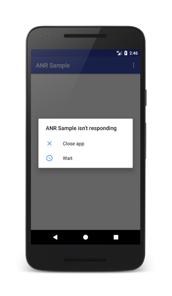
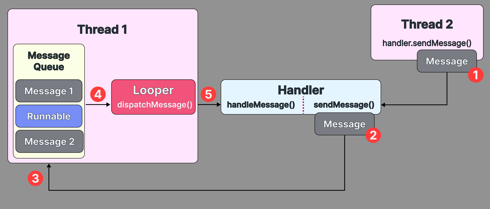

+++
title = "Looper, MessageQueue, Handler"
date = 2026-03-16T00:00:00+09:00
draft = false
description = "Android 의 비동기 메시지 처리 핵심인 Looper, Handler, MessageQueue 의 동작 원리를 살펴봅니다."
tags = ["Android", "Handler", "Looper", "MessageQueue"]
series = ["Android Threading"]
+++

기본적으로 JVM 프로그램은 `main` 함수가 끝나는 즉시 애플리케이션이 종료된다. 하지만 안드로이드는 명시적으로 종료를 선언하기 전까지 실행 상태를 유지하는데, 이는 메인 스레드 내에서 끊임없이 돌아가는 `Looper` 덕분이다.

`Looper` 는 안드로이드 애플리케이션의 실행 상태를 유지하는 것 외에도, 안드로이드의 UI 요소를 안정적으로 그리는 데에도 핵심적인 역할을 수행한다. 이번 포스팅에서는 `Looper` 를 중심으로, 이와 밀접하게 연관된 `Handler` 와 `MessageQueue` 에 대해서도 알아본다.

---

## 안드로이드 시스템 구조
`Looper` 를 이해하기 위해, 먼저 안드로이드의 시스템 구조부터 간략하게 파악해보자.

안드로이드는 기본적으로 싱글 스레드 구조를 채택했다. 멀티 스레드를 채택하면 병렬성이라는 혜택을 누릴 수 있는데, 왜 싱글 스레드 구조를 채택했을까?

이는 멀티 스레드 구조에서 발생할 수 있는 **경쟁 상태(Race Condition)을 피하기 위함**이다. 물론 멀티 스레드에서도 경쟁 상태를 회피하기 위해 자체적으로 `Lock` 을 거는 등의 방법으로 동기화 처리가 가능하지만, 이 경우 스레드간의 컨텍스트 스위칭(Context Switching)이 잦아져 오히려 **성능이 저하**된다. 빠른 시간안에 UI를 그려 유저에게 제공해야 하는 안드로이드 입장에서, 이러한 멀티 스레드의 성능 저하는 피하고 싶은 부분이었을 것이다.

이런 이유로 안드로이드는 단 하나의 **메인 스레드가 UI와 관련된 모든 요소들을 통제하도록 규정**했다. `View` 를 적합한 곳에 배치시키고 렌더링하는 것은 물론, 안드로이드 컴포넌트의 생명주기 메소드 호출, 클릭 이벤트 처리 등 굉장히 다양한 작업을 수행한다. **UI를 변경할 수 있는 유일한 스레드**이기 때문에, 안드로이드 진영에서는 메인 스레드에 대해 **UI 스레드**라는 표현을 자주 사용한다.

</br>
</br>

하지만 당연하게도(?) 애플리케이션의 역할이 UI 렌더링에만 국한되지는 않는다. API를 호출하여 실제 데이터를 받아와야 하고, 무거운 연산을 통해 화면 출력에 필요한 값을 추출해낼 수도 있어야 한다. 문제는 이 작업들을 메인 스레드에서 수행할 경우, **UI 업데이트 작업이 뒤로 밀리면서 사용자에게는 화면이 멈춘 듯한 인상을 줄 수 있다는 점**이다.

이는 사용자 경험에 매우 치명적이므로, 안드로이드는 메인 스레드가 일정 시간동안 블로킹된 것을 포착한 경우 즉시 [ANR](https://developer.android.com/topic/performance/vitals/anr?hl=ko)을 일으켜 사용자에게 애플리케이션을 강제 종료할 것이냐고 묻는다.



이러한 문제를 방지하기 위해서는 **API 호출이나 무거운 연산 작업을 백그라운드 스레드에서 수행하도록 분리**해야 한다. 백그라운드에서 작업 결과물만을 받아온 뒤, 메인 스레드에는 이를 화면에 그리라는 명령만 전달하는 구조를 설계하는 것이 가장 바람직하다.

그리고 이 바람직한 구조를 구현하기 위해 나온 개념이, 이번 포스팅에서 다룰 **`Looper`, `MessageQueue`, `Handler`** 이다.

### 전체 흐름
`Looper`, `MessageQueue`, `Handler` 를 활용하여 백그라운드 스레드에서 API를 호출하고 받아온 결과물을 UI에 갱신하는 흐름은 다음과 같이 전개된다.



오른쪽 박스부터 순차적으로 살펴보면,

1. 백그라운드 스레드에서 무거운 작업을 처리하고, 받아온 결과물을 토대로 `Message` 를 만든다.
2. `Handler` 는 `Message` 를 그대로 어딘가에 전송한다.
3. 전송한 `Message` 는 `MessageQueue` 에 저장된다.
4. 메인 스레드의 `Looper` 가 `MessageQueue` 에서 대기 중인 `Message` 를 순차적으로 추출한다.
5. `Looper` 는 추출한 `Message` 를 다시 `Handler` 에게 전달한다.
6. `Handler` 는 전달받은 결과물을 바탕으로 **메인 스레드에서 안전하게 UI를 갱신**한다.

코드로는 다음과 같이 구현할 수 있다.

```kotlin
class MainActivity : AppCompatActivity() {
    // 1. 메인 스레드의 Looper 를 사용하는 Handler 생성
    private val mainHandler = object : Handler(Looper.getMainLooper()) {
        override fun handleMessage(msg: Message) {
            // 5. Looper 로부터 메시지를 전달받아 UI 갱신 작업을 수행한다.
            val result = msg.obj as String
            textView.text = result;
        }
    }

    override fun onCreate(savedInstanceState: Bundle?) {
        super.onCreate(savedInstanceState)
        setContentView(R.layout.activity_main)

        thread(start = true) {
            performHeavyTask()
        }
    }

    /** 무거운 연산을 수행하는 함수 */
    private fun performHeavyTask() {
        // 무거운 연산 수행 중...
        Thread.sleep(2000) 
        val data = "백그라운드에서 계산된 데이터"

        // 2. Handler 가 Message 를 생성하고 전송한다.
        val message = mainHandler.obtainMessage().apply {
            obj = data // 결과물도 Message 에 포함시킨다.
        }
        
        // 3. 전송된 Message 는 메인 스레드의 MessageQueue 에 저장된다.
        mainHandler.sendMessage(message)
    }
}
```

사실 요즘은 `Coroutines` 을 활용해 대부분의 비동기 처리를 수행하기 때문에 목격하기 힘든 코드긴 하다. 2026년 현재 시점에 해당 코드와 비슷한 로직을 회사 내에서 목격했다면 조의를 표한다..

그럼에도 **`Handler` 와 `Looper` 는 안드로이드 동시성 처리의 뼈대**와 같다. 겉으로 드러나지 않을 뿐, 우리가 자주 사용하는 `viewModelScope` 나 `Dispatchers.Main` 의 내부를 살펴보면 위에서 봤던 그림, 코드의 개념들이 잔잔하게 스며들어 있다. 따라서 안드로이드 동시성 처리를 빠삭하게 이해하하고 싶다면, 결국 `Handler` 와 `Looper`, `MessageQueue` 에 대해 좀 더 파고들어야 한다.

## Looper
먼저 `Looper` 부터 살펴보자.

`Looper` 는 이름을 보면 알 수 있듯이, **한 번 실행이 되면 명시적으로 종료하기 전까지 무한 루프를 도는 객체**이다. 무한정 도는 객체가 스레드 내에 여러 개 존재할 수 없고, 그래서도 안되기 때문에 `Looper` 는 하나의 스레드당 하나만 존재할 수 있다.

이를 보장하기 위해 안드로이드는 **`ThreadLocal`** 이라는 고유한 저장소를 통해 `Looper` 를 관리한다. 만약 특정 스레드에 이미 `Looper` 가 할당되어 있는데 또 다시 생성을 시도하면, **즉각적으로 에러를 발생시켜 중복 생성을 방지**한다.

동시성 처리 구조에서는 위 그림에서 봤듯이 무한 루프를 돌면서 `MessageQueue` 에 저장된 `Message` 를 꺼내 `Handler` 에게 전달하는 역할을 맡는다.

### 메인 스레드의 Looper

그렇다면, 안드로이드 메인 스레드의 `Looper` 는 언제, 어떻게 생성될까?

```java
public final class ActivityThread extends ClientTransactionHandler
        implements ActivityThreadInternal {
    
    static volatile Handler sMainThreadHandler; // 메인 메소드에서 한 번만 set 한다.
    
    public static void main(String[] args) {
        AndroidForwardingOs.install();
        // . . .
        
        Looper.prepareMainLooper(); // Main Looper 준비
        
        // . . .
        
        ActivityThread thread = new ActivityThread();
        thread.attach(false, startSeq);
        
        if (sMainThreadHandler == null) {
            sMainThreadHandler = thread.getHandler();
        }
        
        Looper.loop(); // 무한 반복하며 UI Message 처리
        
        throw new RuntimeException("Main thread loop unexpectedly exited");
    }
}
```

자바 프로그램에서도 `main` 메소드라는 시작점이 있듯이, **안드로이드에는 `ActivityThread` 라는 시작점**이 존재한다.

`ActivityThread` 의 `main` 메소드는 애플리케이션 실행 시 자동 호출된다. 이 때 `Looper.prepareMainLooper` 를 호출해 메인 스레드에 할당된 `Looper` 가 초기화되며, 작업 준비를 마친 `Looper` 는 무한 루프를 돌며 앱의 실행 상태를 유지한다. 그러면서 동시에 UI 렌더링, 컴포넌트 생명주기 콜백 등 메인 스레드의 핵심 작업들을 순차적으로 처리한다.

```java
public final class Looper {
    @UnsupportedAppUsage
    private static Looper sMainLooper;  
}

@Deprecated
public static void prepareMainLooper() {
    prepare(false); // Looper 가 종료되지 않음을 보장한다.
    synchronized (Looper.class) {
        if (sMainLooper != null) {
            throw new IllegalStateException("The main Looper has already been prepared.");
        }
        sMainLooper = myLooper(); // 여기서 MainLooper 가 저장된다.
    }
}
public static Looper getMainLooper() {
    synchronized (Looper.class) {
        return sMainLooper;
    }
}
public static @Nullable Looper myLooper() {
    return sThreadLocal.get();
}
```

메인 스레드에 할당된 `Looper` 는 **`Looper.getMainLooper`** 메소드를 통해 **애플리케이션 전역에서 언제든 사용**할 수 있다.

### loop()

`Looper` 의 핵심 메소드인 `loop` 는 다음과 같이 동작한다.

```java
public static void loop() {
    final Looper me = myLooper();
    if (me == null) {
        throw new RuntimeException("루퍼 미존재" +
                    "Looper.prepare() 메소드를 해당 스레드에서 실행하지 않았음");
    }
    
    // . . .

    for (;;) {
        if (!loopOnce(me, ident, thresholdOverride)) {
            return;
        }
    }
}
// true 리턴 시 Looper loop 유지, false 리턴 시 종료
private static boolean loopOnce(
    final Looper me,
    final long ident, 
    final int thresholdOverride
) {
    Message msg = me.mQueue.next();
    
    // quit 혹은 quitSafely 를 호출한 경우에만 msg 는 null 이 된다.
    if (msg == null) {
        // false 를 리턴하여 Loop 종료 처리
        return false;
    }
    
    msg.target.dispatchMessage(msg); // 메시지 처리
    msg.recycleUnchecked();
    
    return true;
}

public void quit() {
    mQueue.quit(false)
}

public void quitSafely() {
    mQueue.quit(true);
}
```

참고로, 메인 스레드의 `Looper` 는 처음 준비 단계부터 `Looper` 를 종료할 수 없도록 제한하였으므로, `quit` 이나 `quitSafely` 메소드를 호출하면 `IllegalStateException` 이 발생한다.

`quit`, `quitSafely` 의 차이는 다음과 같다.

- `quit` - 호출하는 즉시 종료
- `quitSafely` - 호출 시점까지 쌓여있던 작업들은 처리하고, 이후에 종료

다음으로는 `MessageQueue` 에 대해 살펴보자.

## MessageQueue
모든 `Looper` 는 자신만의 `MessageQueue` 를 가진다. `MessageQueue` 는 말그대로 `Message` 를 담는 자료구조로, `LinkedList` 기반으로 동작한다. 이름에서 알 수 있듯이 `Queue` 의 특성을 가지고 있지만, 일반적인 `Queue` 와 달리 **`Priority Queue` 형태**로 동작한다.

`Message` 의 우선순위는 **'언제 실행되어야 하는지(when)'** 를 기준으로 정해진다. 당연히 실행 시점이 빠른 것부터 순차적으로 쌓여지며, 나중에 주입된 `Message` 라도 실행 시점이 기존 `Message` 보다 빠른 경우 `Queue` 중간에 삽입된다. `MessageQueue` 가 목록 관리 자료구조로 `Array` 대신 `LinkedList` 를 채택한 이유가 바로 이 빈번한 중간 삽입 작업때문이다.

`MessageQueue` 에 쌓이는 `Message` 는, 다음과 같은 데이터들을 가지고 있다.

```java
public final class Message implements Parcelable {
    // 메시지 식별을 위한 사용자 정의 메시지 코드, 메시지 용도 구분을 위해 사용
    public int what;
    // 간단한 정수값을 저장할 때 사용
    public int arg1;
    // 간단한 정수값을 저장할 때 사용
    public int arg2;
    // 메시지와 함께 전달할 단일 객체, 직렬화된 객체만을 담아야 함
    public Object obj;
    // IPC 통신 시 사용하는 객체
    public Messenger replyTo;
    // 메시지가 처리되어야 하는 예정 시간을 나타내는 타임스탬프
    public long when;
}
```

데이터들을 봤을 때 어려울만한 필드는 역시 `replyTo` 일 것이다. `replyTo` 는 [`Binder IPC` ](https://appisode.me/posts/binder-ipc/) 통신 시 사용하는 데이터로, 예제 코드를 보면 이해가 좀 더 쉬울 것이다. 다음은 **`Activity` 와 `Service` 간에 데이터를 주고받을 때**의 상황을 예시로 한 코드이다.

```kotlin
// MainActivity.kt
// Service 로부터 받아온 값을 기반으로 UI를 업데이트한다.
val myMessenger = Messenger(Handler(Looper.getMainLooper()) { msg ->
    val data = msg.arg1.toString() 
    binding.tv.text = data
    true
})

// Service 로 전송할 Message 를 작성한다.
val requestMsg = Message.obtain().apply {
    what = MSG_DO_WORK
    replyTo = myMessenger // Service 에서는 해당 Messenger 를 통해 결과를 전송한다.
}

serviceMessenger.send(requestMsg)
```

```kotlin
// Service.kt
val handlerThread = HandlerThread("MyServiceBackgroundThread") 
handlerThread.start()

val serviceHandler = Handler(handlerThread.looper) { msg ->
    when (msg.what) {
        MSG_DO_WORK -> {
            // 작업 처리 . . . . . . . . . . . . . . 
            val result = 100 
            val replyMsg = Message.obtain().apply { arg1 = result }

            // Activity 에서 전송한 replyTo(Messenger) 를 통해 결과값을 전달한다.
            msg.replyTo?.send(replyMsg) 
        }
    }
    true
}
```

코드를 보면 알 수 있듯 **현재 사용하고 있는 컴포넌트 외에 다른 컴포넌트와 통신해야 하는 경우, `replyTo` 를 주로 사용**한다. `Service` 내에서 백그라운드 작업을 진행한 후, `Activity` 로 데이터를 넘겨야 하는 경우 위의 방법도 고려해보자.

### Object Pool 을 활용한 최적화
`Message` 는 보통 한 번 생성하고 전달하면 사용하지 않게 되는 것이 대부분이므로, 안드로이드에서는 `Message` 에 대해 자체적인 최적화를 적용했다. 바로 `Static Object Pool` 을 사용하는 것으로, 한 번 생성한 `Message` 는 바로 제거되지 않고 `Pool` 에 담겨 지속적으로 재사용된다.

```kotlin
// Message.java
public static final Object sPoolSync = new Object();
private static Message sPool;
private static int sPoolSize = 0;

private static final int MAX_POOL_SIZE = 50;

public static Message obtain() {
    synchronized (sPoolSync) {
        if (sPool != null) {
            Message m = sPool;
            sPool = m.next;
            m.next = null;
            m.flags = 0; // clear in-use flag
            sPoolSize--;
            return m;
        }
    }
    return new Message();
}
```

`Pool` 에 저장된 `Message` 를 사용하기 위해서는 `Message` 의 기본 생성자를 사용해선 안되고, **`Message.obtain` 메소드나 `Handler.obtainMessage` 를 호출**해야 한다.

한 번 작업을 마친 `Message` 는 내부 속성이 모두 초기화되며, `Pool` 이 아직 최대 사이즈(50)에 도달하지 않았다면 다시 `Pool` 에 추가된다. 사용 측에서 `Message` 를 요구하는 경우,  새로 생성하는 대신 `Pool` 에서 우선적으로 꺼내어 쓴다.


## Handler
**`Handler` 는 `Message` 와 `Runnable` 을 처리(handle)** 하며, 크게 두 가지 핵심 역할을 수행한다.

1. **메시지 송신** - 백그라운드 스레드에서 무거운 작업이 끝났을 때, 작업 결과나 이에 따른 `callback` 을 `MessageQueue` 에 보관한다. 작업 결과는 `Message`, `callback` 은 `Runnable` 이라고 할 수 있다.
2. **메시지 수신** - `Looper` 가 `MessageQueue` 에서 `Message` 를 꺼내 전달하면, 이를 받아 UI 갱신 등 필요한 작업을 수행한다.

**`Handler` 의 중요 특징 중 하나는 스레드와 운명 공동체라는 것**으로, `Handler` 는 생성되는 순간 **자신을 생성한 스레드의 `Looper` 와 영구적으로 연결**된다. 당연히 스레드가 종료되면 해당 스레드에 종속된 `Looper`, `Handler` 는 함께 제거된다.

```kotlin
class MyBackgroundThread extends Thread {
    public Handler backgroundHandler;

    @Override
    public void run() {
        Looper.prepare(); // ⚠️ Looper 를 먼저 준비해주어야 한다.

        backgroundHandler = new Handler(Looper.myLooper()) {
            @Override
            public void handleMessage(Message msg) {
                // 다른 스레드에서 backgroundHandler.sendMessage() 를 호출하면
                // 여기서 메시지를 받아 별도 작업을 수행할 수 있다.
                System.out.println("백그라운드에서 메시지 처리 중: " + msg.what);
            }
        };

        // 큐에 들어오는 메시지를 무한히 기다리며 처리 시작 (블로킹)
        Looper.loop();
    }
}
```

위 코드는 `Handler` 의 대표적인 활용 예시이다. 여기서 주의할 점은 다른 스레드에서 **`Handler` 를 사용할 경우 반드시 `Looper.prepare()` 를 먼저 호출해야 한다는 것**이다. 이유는 위에서 얘기했듯 `Handler` 는 항상 대상 스레드의 `Looper` 를 사용하도록 강제되었기 때문에, `Looper` 가 준비되지 않았을 때 `Handler` 를 생성하려 시도하면 즉시 오류가 발생한다.

또한, **백그라운드 스레드를 사용하는 상황에서 UI를 업데이트해야 하는 경우**에는 **`Handler` 의 파라미터로 `Looper.getMainLooper` 를 호출**해주어야 한다. 이에 대한 이유도 위에서 언급했듯, 백그라운드 스레드에서 UI를 갱신할 경우 즉시 오류가 발생하기 때문이다.

---

이번 포스팅에서는 안드로이드 동시성 처리의 조상님인 `Looper`, `MessageQueue`, `Handler` 에 대해 알아보았다. 다음 포스팅에서는 이를 바탕으로, 현재 실무에서 주로 다루는 `Coroutines` 이 이 요소들을 내부적으로 어떻게 활용하고 있는지 구체적으로 살펴본다.

---

**References**

[Processes and threads overview](https://developer.android.com/guide/components/processes-and-threads)</br>
[Handler](https://developer.android.com/reference/android/os/Handler)</br>
[안드로이드 프로그래밍 Next Step - 2장, 메인 스레드와 Handler](https://www.yes24.com/product/goods/41085242)</br>
- Android Code Search
	- [ActivityThread](https://cs.android.com/android/platform/superproject/+/android-latest-release:frameworks/base/core/java/android/app/ActivityThread.java;l=320?q=ActivityThread&sq=&hl=ko)
	- [Looper](https://cs.android.com/android/platform/superproject/main/+/main:frameworks/base/core/java/android/os/Looper.java;l=1?q=Looper.java&sq=&hl=ko)
	- [MessageQueue](https://cs.android.com/android/platform/superproject/+/android-latest-release:frameworks/base/core/java/android/os/DeliQueue/MessageQueue.java;l=1?q=MessageQueue.java&hl=ko)
	- [Message](https://cs.android.com/android/platform/superproject/+/android-latest-release:frameworks/base/core/java/android/os/Message.java;l=212?q=sPoolSync&hl=ko)
