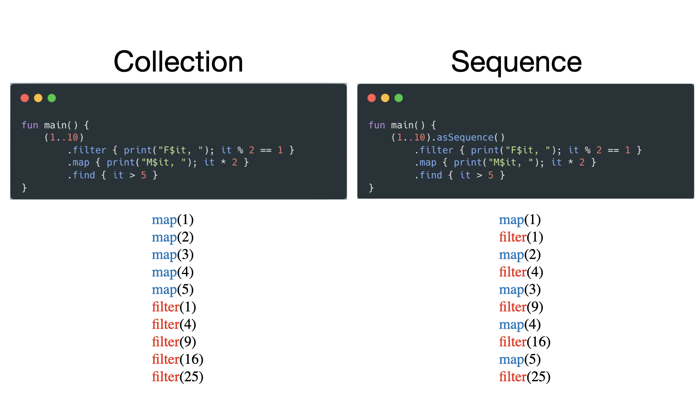
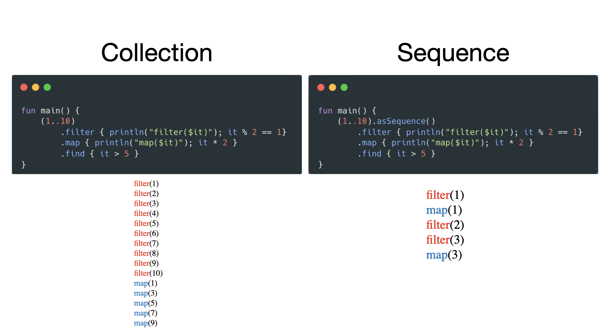

+++
title = "Sequence"
date = 2024-03-03
draft = false
description = "대용량 데이터 처리에서 Collection 대신 Sequence가 성능에 유리한 이유를 설명합니다."
tags = ["Kotlin"]
+++

프로그램을 개발하며 `Collection` 을 사용해보지 않은 개발자는 한 명도 없을 것이다. 특히 코틀린 개발자는 어떠한 리스트가 필요할 때 `Collection` 을 습관적으로 사용하는 경우가 대부분일 것이다. 하지만, 대량의 데이터를 다룰 때에도 `Collection` 을 사용한다면, 애플리케이션의 성능을 저하시킬 우려가 있다. **코틀린에서는 대량의 데이터를 처리해야 하는 경우 빠른 연산을 자랑하는 `Sequence` 의 사용을 권장**한다.

## `Collection` 을 사용하면 성능이 저하되는 이유

`Collection` 을 사용하면 왜 애플리케이션의 성능이 저하될까?

```kotlin
val file = File("Hoyahozz.csv").readLines()

file
    .filter { it.startsWith("ho") } // new List
    .drop(5) // new List
    .mapNotNull { it.split(",").getOrNull(6) } // new List
    .count()
```

코틀린으로 개발을 하다보면 많이 볼 수 있는 형태의 코드 전개이다. 하나의 리스트에 대해 여러 처리 함수를 사용하고 있는데, **문제는 각 함수를 호출할 때마다 새로운 `Collection` 이 반환된다는 점**이다. 하지만 당연하게도 중간에 사용된 `Collection` 은 결국 사용되지 않고, 오로지 마지막에 있는 `Collection` 만 사용하므로 오버헤드가 발생한다. 

만약 `File` 의 크기가 1.5GB였다고 가정한다면, **중간 연산에서 `Collection` 이 3번이나 생성되므로 런타임 환경에서 `OutOfMemoryError` 가 발생할 것**이다. 이를 막기 위해선, **처리 함수를 호출할 때마다 새로운 `Collection` 이 생성되지 않도록 구현**해야 한다.

## 데이터 리스트를 효율적으로 처리하는 `Sequence`

이럴 때 사용할 수 있는 기술이 바로 **`Sequence`** 이다.

```kotlin
val file = File("Hoyahozz.csv")

file.useLines { lines -> // Sequence<String>
    lines
        .filter { it.startsWith("ho") }
        .drop(5)
        .mapNotNull { it.split(",").getOrNull(6) }
	    .count()
}
```

얼핏 보면 `Collection` 과 별반 달라보이지 않지만, 연산 방식에는 매우 큰 차이가 있다. 우선 가장 크게 와닿는 차이는, **`Collection` 과 달리 연산을 처리할 때 어떠한 `Collection` 도 새롭게 생성하지 않는다는 점**이다. 이로 인해 `Collection` 에서는 `outOfMemoryError` 가 발생했던 로직을 `Sequence` 로 변환 후 그대로 호출하면 아무런 오류가 발생하지 않는다. 즉, **메모리 효율과 성능이 `Collection` 을 사용했을 때에 비해 크게 개선된 것이다.**

그렇다면 중간 연산 과정에서 `Collection` 이 왜 생성되지 않는걸까? 이는 함수 사용 시 즉시 연산(eager evaluation)을 활용하는 `Collection` 과 달리 **`Sequence` 는 `count()` 와 같은 종결 연산을 호출한 순간에만 연산이 수행되는 지연 연산(lazy evaluation) 을 활용했기 때문**이다.

메모리 효율이 크게 개선되는 것 외에도 `Collection`, `Sequence` 사이에 또 다른 차이가 존재한다.



위 이미지를 보면, **연산의 처리 순서가 다른 것**을 볼 수 있다. **`Sequence` 는 요소마다 지정한 연산을 한 번에 적용하는 반면, `Collection` 의 경우 요소의 전체를 대상으로 연산을 적용**한다. 이 특징을 조금만 더 생각해보면, `Sequence` 는 `Collection` 보다 **연산 횟수도 단축시킬 수 있음**을 유추할 수 있다.



`Collection` 의 경우 함수를 하나 처리할 때마다 모든 요소에 대한 연산을 진행해야 한다. 하지만, `Sequence` 의 경우 중간 연산이라는 개념이 있으므로 **이미 원하는 결과물을 얻었다면 이후의 요소에 대한 연산은 진행하지 않는다.** 이러한 방식을 통해 **`Sequence` 는 불필요한 연산을 줄여 데이터 처리에 대한 성능을 개선**시킬 수 있다.

## 항상 좋을까?

```kotlin
sequenceOf(1..100)
    .sorted()
```

**`Sequence` 를 사용한다고 해서 성능이 항상 개선되는 것은 아니다.** **리스트 전체를 기반으로 연산을 처리해야 하는 경우, 오히려 `Collection` 보다 느려지는 경우가 발생**한다. 대표적인 예시가 **`sorted`** 함수로, `sorted` 는 요소끼리의 비교 연산이 필수적이므로 각 요소만으로는 정렬을 수행할 수 없다. 결국 `Sequence` 내부에서 `Collection` 으로 변환한 후, `Collection` 의 `sort` 를 호출한다. 

**`Sequence` 를 `Collection` 으로 변환하고, `Collection` 을 다시 `Sequence` 로 변환하는 과정이 추가되어 오히려 성능이 악화**된다.

```kotlin
val list = (1..10).asSequence()
    .map { it * 2 }
    .toList()
```

**또한, 다루는 요소의 수가 적고 처리 연산이 적은 경우에도 `Sequence` 를 활용하면 오히려 성능이 악화**된다. 이유는 위와 동일하게 **불필요한 변환**이 발생하기 때문이다. **대량의 데이터를 다루거나, 처리 연산의 수가 많은 경우에만 `Sequence` 의 사용을 검토하고, 그것이 아니라면 `Collection` 을 사용**하는 것이 좋다.

---

**References**

[Sequence Explained - Kotlin Collections](https://www.youtube.com/watch?v=_F4ZzK2Iquc)</br>
[이펙티브 코틀린 8장, 아이템 49 - 하나 이상의 처리 단계를 가진 경우에는 시퀀스를 사용하라](https://product.kyobobook.co.kr/detail/S000001033129)</br>
